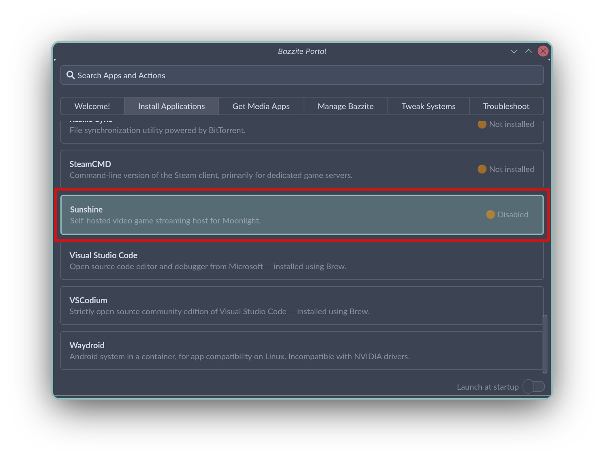
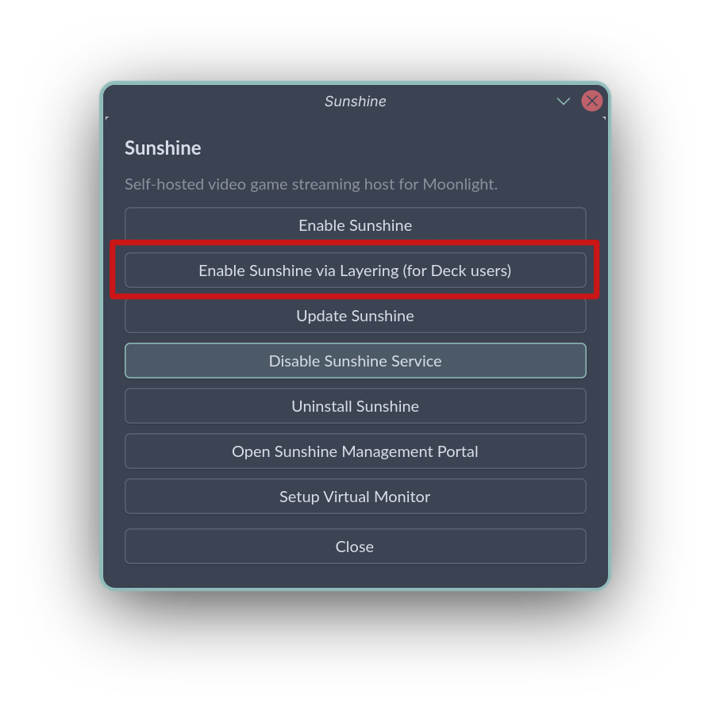

# Setting up Sunshine on Bazzite

## What is Happening to Sunshine on Bazzite?

The Sunshine package is historically shipped and updated with the image. For a long time, Sunshine did not provide a stable package for Fedora 43 and 44, and this forced Bazzite to use the Sunshine-Beta package instead, causing users to have non-functional streaming after an update numerous times, due to multiple changes to their systemd service name.
Removing Sunshine from the base image allows Sunshine's versions to stay independent of Bazzite updates, avoiding the aforementioned situation. 

The recommended way of setting up Sunshine on Bazzite is through **Bazzite Portal**, which now helps you set up the stable Sunshine **flatpak** package and via layering for **-deck** images.

!!! info 

    As of 16th May 2026, Sunshine has finally provided an F43 and F44 package. However the removal of Sunshine from the base Bazzite image has already occured along with the update to Fedora 44 on 29th April 2026.
    
    Additionally, the brew installation included previously is now completely removed and considered unsupported as it proved much too unreliable and error-prone. Users are encouraged to choose between the two installation methods Bazzite provides.

---

## Setting up Sunshine

!!! warning "It is highly recommended that you do this with physical access to your machine, or at least with an ssh connection set up."

=== "Desktop (Flatpak)"

    !!! notice "Users of Bazzite-Deck images, please read this [Section](#__tabbed_1_2)"

    The guide below will walk you through installing the Sunshine flatpak.

    1. Open the Bazzite Portal and select **Sunshine**
    
    2. Select **Enable Sunshine**
    
    3. A Terminal Window will appear. Wait for the installation to complete and you will be prompted to input your password to give extra permissions to Sunshine for screen capture and other functionalities.
    4. This is a good time to test if your new setup works - Your settings should persist.

=== "Deck (Layer)"

    !!! info 

        Deck Images make use of Valve's gamescope microcompositor while in **Game Mode**. 
        
        As gamescope does not support capture via XDG Portal or Kwin Screencast, streaming must be done using KMS Capture. As the flatpak package of Sunshine does not support Capture via Kernel Mode Setting, you will need to install Sunshine via alternate means if you want to stream from **Game Mode**. However, you may still stream via XDG Portal/KWin Screencast capture if you use **Desktop Mode**.

    Bazzite Portal provides an aptly named **Enable Sunshine via Layering(for Deck users)** option to help users set up Sunshine. Simply follow the steps below:

    1. Open the Bazzite Portal and select **Sunshine**
    
    2. Select **Enable Sunshine via Layering(for Deck users)**
    
    3. A Terminal Window will appear. Wait for the installation to complete and you will be instructed to restart.

    !!! tip

        As layering does not permit us to set up the autostart service before hand, we need to enable the service **after** restarting. This can be done by either:

        *   Selecting **Enable Sunshine via Layering(for Deck users)** in Bazzite Portal once again; or,
        *   Running `systemctl --user enable --now sunshine`.
        
    4. You may now test whether Sunshine works now.
    
    !!! info

        If you encounter bugs such as missing menus during streaming, you may want to enable **Force Composite** to ensure proper streams at the cost of a tiny bit of latency. 

        1. Enable developer mode under **Settings → System → Enable Developer Mode**.
        2. Under the **Miscellaneous** section, enable **Force Composite**.

=== "Command Line"

    Run the following command:
    
    ```bash
    ujust setup-sunshine
    ```
    and choose the relevant options. Read [this](#comparison-of-ways-to-install-sunshine-on-bazzite) for details.

---

## Limitations of the Flatpak Package

Lizardyte only provides the stable Sunshine **flatpak** package on flathub, which also is limited by Flatpak's sandboxing. The following are some common limitations you may run into:

*   Inability to stream inside [Steam Gaming Mode(Gamescope-Session)](/Handheld_and_HTPC_edition/quirks/#steam-gaming-mode-quirks-and-workarounds)
*   Inability to stream using the Kernel Mode Setting capture method
*   Inability to stream with HDR, which XDG Portal and KWin Screencast does not currently support

In these cases, users are encouraged to use the [Layering method](#__tabbed_1_2) provided for Deck users.

!!! info "The brew installation included previously is now completely removed and considered unsupported as it proved much too unreliable and error-prone. Users are encouraged to choose between the two installation methods Bazzite provides."

---

## Comparison of Ways to Install Sunshine on Bazzite

| Method                         | Flatpak (Bazzite Portal)                    | Layer (Bazzite Portal, Deck Method)               | Layer from Official COPR                          |
| :----------------------------: | :------------------------------------------ | :------------------------------------------------ | :------------------------------------------------ |
| Doesn't block system updates   | ✅ User space Installation                  | ✅ Is actively maintained by **pvermeer**         | ❌ May block updates if COPR is not updated       |
| Independent version from image | ✅ Manual pinning possible                  | ❌ Manual pinning not possible via rpm-ostree<small>1</small> | ❌ Manual pinning not possible via rpm-ostree<small>1</small> |
| Kernel Mode Setting Capture    | ❌ SetCap not supported by Flatpak          | ✅ No known issues                                | ✅ No known issues                                |
| Stable Version                 | ✅ Stable is used by default                | ✅ Auto updates, Community-Tested                 | ❌ Inconsistent builds for Fedora releases<small>2</small>    |
| Beta Version                   | ℹ️ Requires manual installation and updates | ✅ Auto updates, Community-Tested                 | ℹ️ Auto updates, may have breaking changes        |
| Stability & Support            | ✅ Offically Supported                      | ✅ Auto updates, Community-Tested                 | ❌ Inconsistent builds for Fedora releases<small>2</small>    |

<small>_1: Technically, you can grab and manually layer the builds generated from the COPR, but that requires you to uninstall and reinstall and is not recommended._</small>
<small>_2: Sunshine had inconsistent builds for their stable package (as in not providing packages for new fedora releases). See [this section](/Advanced/sunshine/#what-is-happening-to-sunshine-on-bazzite)._</small>

Ultimately, it was decided to use Flatpak for desktop and Layer for deck images in the Bazzite Portal's Sunshine installation helper.

---

## Streaming Using a Virtual Display

See [Custom Resolutions](/Advanced/custom_resolution/#guide-for-creating-a-custom-resolution-for-sunshine-game-streaming)

---

## Installing Sunshine Beta

Sunshine does not provide a repository for their flatpak package. You may try to install Sunshine Beta with alternative ways as listed below, albeit with some limitations.
!!! notice "Installation of Sunshine via these methods is not officially supported. Please report issues with Sunshine **Beta** to the main Sunshine repository, and issues with packaging to their respective packaging repositories."

=== "Installing the Beta Flatpak manually"

    Sunshine does not provide a Beta repository for their flatpak, nor host them on the flathub-beta repository, so you will need to download the flatpak manually from their [GitHub Releases Page](https://github.com/LizardByte/Sunshine/releases)
    1. Click `Read more` at the bottom of your desired release.
    2. Find and download `sunshine_x86_64.flatpak` (or aarch64 for arm devices). Your downloaded file should be saved to `~/Downloads/`
    3. Run the following commands:
    ```bash
    flatpak install --system ~/Downloads/sunshine_x86_64.flatpak
    flatpak run --command=additional-install.sh dev.lizardbyte.app.Sunshine
    systemctl --user enable --now app-dev.lizardbyte.app.Sunshine
    ```
    !!! info "You will have to manually update the package by repeating the steps above for each version."

=== "Layering a community maintained beta package"
    
    Layering the Sunshine/Sunshine-Beta community maintained [package](https://copr.fedorainfracloud.org/coprs/pvermeer/sunshine/) by running
    ```bash
    sudo dnf5 copr enable pvermeer/sunshine
    rpm-ostree install sunshine-beta
    ```
    !!! info "This community package is maintained by *pvermeer*, who also provides and maintains the Sunshine package for Bazzite, with improvements to the build system from upstream."
    
=== "Layering the official LizardByte package"
    
    This is similar to the situation when sunshine is/was included in the image.
    Layering the Sunshine Beta package from the [official Beta COPR](https://copr.fedorainfracloud.org/coprs/lizardbyte/beta/) by running
    ```bash
    sudo dnf5 copr enable lizardbyte/beta
    rpm-ostree install Sunshine
    ```
    !!! warning "Note that this will stop system updates from occurring if Sunshine does not provide an updated package for future Fedora version updates (e.g. Fedora 45). You will be asked to run `rpm-ostree reset` to remove all layered packages when this situation arises."
    
    !!! info "Users are encouraged to use the community maintained package instead as the LizardByte packages had a bad history of updates, including but not limited to changing service names breaking streaming, and lack of updated builds for new Fedora Releases."

---

## Something Went Wrong, What Should I do?

### Is a display connected and turned on? (error 503)

This usually means that the Sunshine executable has trouble capturing the screen. 

=== "KWin ScreenCast"

    On some KDE Plasma/Sunshine versions, the permission of KWin ScreenCast is not set up properly with the `zkde_screencast_unstable_v1` protocol. It can temporarily be fixed by setting the `KWIN_WAYLAND_NO_PERMISSION_CHECKS=1` environment variable, which can be done automatically in [Bazzite Portal](/Installing_and_Managing_Software/Bazzite_Portal/) → Install Applications → Setup Virtual Monitor → Fix Error 503, or by setting it in any of the following 3 places:
    
    -   System Wide Configuration: `/etc/environment.d/`
    -   User Configuration: `~/.config/environment.d/` (Bazzite Portal sets it here)
    -   KDE Plasma Specific Configuration: `~/.config/plasma-workspace/env/kwin_vars.sh`
    
    !!! info "You may also try explicitly allowing the `Remote control` option under KDE Settings 🡒 Application Permissions 🡒 Sunshine. "

=== "Kernel Mode Setting"
    
    !!! warning "Kernel Mode Setting capture does **not** work on the Flatpak version of Sunshine due to Flatpak's sandboxing."
    On installations via Brew, this generally means that the Sunshine executable is not given permission to capture the screen with Kernel Mode Setting. You can fix it by updating Sunshine through Bazzite Portal or manually running the post install script in `/usr/libexec/sunshine-postinst`.
    
=== "XDG Portal"

    Try to remove and set permissions for screen capture again. An XDG Desktop Portal window should pop up once asking for permissions for remote desktop.
    
=== "Other Capture Methods"
    
    !!! warning "Capturing with X11 is not supported. Screen capture is now handled via the compositor of your Desktop Environment (Kwin or Mutter) or via Kernel Mode Setting."
    -   X11 is not supported by Bazzite.
    -   NvFBC is an X11-specific option, and is thus also not supported by Bazzite.
    -   wlroots uses a specific protocol for wlroots-based compositors, which are usually tiling window managers. Bazzite does not have images with these compositors, so this option should only be needed in custom images with said compositors.

---

Should you encounter any other issue, feel free to reach out on the [Bazzite Discord](/community.md)!

---
