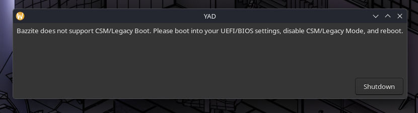

# 常見問題 (FAQ)

## Bazzite的目標受眾

-   追求以運行遊戲為重點、類SteamOS用戶介面、低維護成本的用家
-   需要一個介面對控制器／手柄友好，構建電腦影院的發燒友
-   想在掌上型電腦／掌機上逃離Windows，但其裝置在SteamOS上運行時或有問題、缺失功能的遊戲愛好者
-   想安裝類SteamOS作業系統，但能更快地獲得更新的系統包、內核，而又擁有原子化更新的網友<small>(_既要又要還要這一塊，那還説啥呢？都給你了，還不快裝？_)</small>

## 我應安裝哪一個Bazzite版本？

Bazzite的[網址](https://bazzite.gg/#image-picker)提供一個幫你治理選擇困難症的小工具，快去用吧！

我們在不同版本的基礎上大致能將它們分為**三（3）大類**:

- **1.  桌面版**: 不包含Steam遊戲模式，但仍有各種如Steam等的預安裝軟件，以桌面電腦為本的映像
- **2.  掌機版**: 包含Steam遊戲模式，且預設啟動為遊戲模式，主要為控制器／手柄用家而設的類SteamOS映像
- **3.  開發者版**: 預安裝VS Code、Docker，為開發者而設的映像

### 1.  桌面版

**此版本不包含Steam遊戲模式！**

桌面版Bazzite作業系統。自動更新預設為開啟，為目前運行Windows的電腦之平替系統。

### [2.  掌機版(Bazzite-Deck Edition)](../Handheld_and_HTPC_edition/Steam_Gaming_Mode.md)

包含Steam遊戲模式，預設啟動為遊戲模式<small>(_當然，你也可以進入Steam桌面模式！在桌面版裏的所有功能，這裏也有！_)</small>，主要為控制器／手柄用家而設，自動更新功能預設為**關**。

### [3.  開發者版 (Bazzite-DX/Developer eXperience Edition)](https://dev.bazzite.gg/)

特別為開發者而設的版本。此版本不設獨立ISO，你需要[切換更新頻道](/Installing_and_Managing_Software/Updates_Rollbacks_and_Rebasing/rebase_guide)以安裝此版本。

<hr>

## Bazzite版本列表範例

!!! 溫馨提示

    此列表不包含所有Bazzite映像！

你可以使用以下命令行指令查找你目前系統的映像／更新頻道：

```
rpm-ostree status
```

!!! 重要事宜

    所有Bazzite映像皆以`ostree-image-signed:docker://ghcr.io/ublue-os/...`開頭。<sub> 將 `...` 替換為以下列表範例中的**映像名稱** </sub>

| **映像名稱**                 | 桌面環境             | Steam遊戲模式      | 目標硬件                                   | 類別          |
| --------------------------- | ------------------- | ----------------- | ---------------------------------------- | ------------- |
| `bazzite`                   | KDE Plasma          | 無                | AMD/Intel 顯卡                           | 桌面版       |
| `bazzite-nvidia`            | KDE Plasma          | 無                | Nvidia 顯卡                              | 桌面版       |
| `bazzite-nvidia-open`            | KDE Plasma          | 無                | Nvidia 顯卡 (GTX16+)                             | 桌面版       |
| `bazzite-gnome`             | GNOME               | 無                | AMD/Intel 顯卡                           | 桌面版       |
| `bazzite-gnome-nvidia`      | GNOME               | 無                | Nvidia 顯卡                              | 桌面版       |
| `bazzite-gnome-nvidia-open`      | GNOME               | 無                | Nvidia 顯卡 (GTX16+)                            | 桌面版       |
| `bazzite-deck`              | KDE Plasma          | 有               | AMD/Intel Arc 顯卡                       | 掌機版 |
| `bazzite-deck-nvidia`              | KDE Plasma          | 有               | Nvidia 顯卡 (GTX16+)                       | 掌機版 |
| `bazzite-deck-nvidia-gnome`              | GNOME          | 有               | Nvidia 顯卡 (GTX16+)                       | 掌機版 |
| `bazzite-deck-gnome`        | GNOME               | 有               | AMD/Intel Arc 顯卡                       | 掌機版 |

## 既然SteamOS基於Arch Linux，那為甚麼Bazzite要基於Fedora原子發行版？

雖然SteamOS基於Arch Linux－一類滾動更新的發行版，但其系統包、內核、及驅動更新均較為老舊。你可以理解為SteamOS的各個版本（3.8、3.9等）都是Arch Linux在某一時間的鏡像。
反之，Bazzite基於Fedora－一個採用**點更新模式**的發行版<small>(_而且Fedora一向都是更新較快的發行版_)</small>，並緊隨上游更新。這意味着Bazzite的系統已經經過上游的測試，而各包版本、內核、和驅動都能採用最新的上游版本。

**Bazzite的目標是一個裝完就可以立即運行遊戲，毋須額外設置的作業系統。**

### Bazzite基於Fedora原子發行版有甚麼優勢？

由於Bazzite是一個基於Fedora原子發行版的映像，所以我們可以以唯讀方式將Bazzite作為[**可啟動容器**](https://containers.github.io/bootable/)安裝，享受以下優勢：

-   系統無法啟動的風險微乎其微
-   具自動化和簡易地回溯系統映像的能力
-   類似於Android無縫更新的功能：所有更新都在系統正常運作時進行，無論更新多大都毋須進入特別的「Please do not turn off your PC」更新模式
-   推動用戶層安裝包概念：應用程式不能更改系統文件

> 按[這裏](https://universal-blue.org)前往UniversalBlue獲取更多資訊！

## 我需要額外安裝AMD/Intel的顯卡驅動程式嗎？

**不需要**。在Linux的生態中，AMD、Intel、和其他開源的驅動程式都匯集在上游Linux內核之中。驅動程式會隨著內核版本更新，而內核則會包含在Bazzite的映像裏更新。在使用官方Bazzite映像時，你不能更改系統中的驅動程式和內核版本；反之，Bazzite的每一次更新都會確保發行的驅動程式和內核都沒有問題。

### 我需要額外安裝Nvidia的顯卡驅動嗎？

**不需要**。雖然Nvidia的Linux驅動不跟隨上游Linux內核發佈和更新，但Bazzite依舊會將其打包進系統映像之中。正如上文所提，在使用官方Bazzite映像時，你不能更改映像中的驅動程式；反之，Bazzite的每一次更新都會確保驅動程式的運行沒有問題。此外，因為Nvidia不再為GTX10系列及以前的顯卡提供新版本的驅動程式，Bazzite提供兩種Nvidia映像：

-   舊版（`-nvidia`）映像，採用最後支持Pascal（GTX10）、Maxwell(GTX900、GTX750&745)、和Volta(Titan V)架構的`580`系列驅動程式。
-   新版（`-nvidia-open`）映像。因Nvidia於新版驅動程式將其部分開源化故得其名。此驅動程式支持Turing架構以後的所有Nvidia顯卡（即GTX16系列及所有RTX系列顯卡）。

!!! 重要事宜 "倘若你發現你的Nvidia顯卡未能在Bazzite上正常運作，請確保你正在使用[正確的映像](./#bazzite_2)；以及[Nvidia Flatpak運行環境](/General/issues_and_resolutions/#flatpak-apps-have-no-hardware-acceleration-on-nvidia)已更新。"

### Bazzite會支持更老的Nvidia顯示卡嗎？

目前，由於Nvidia沒有提供相關的驅動程式，所以Bazzite無法支持Kepler架構或以前的顯卡（大部分GTX700系列或更老的顯卡）。

-   理論上，你可以安裝無`-nvidia`後綴的映像，並使用開源逆向工程搓出來的`nouveau`驅動程式，但由於開源組件無法與閉源的GSP顯卡韌體交通，顯卡將會卡死在最低運行頻率，而性能亦將大幅下降。
-   在使用官方Bazzite映像時，你不能更改或安裝舊版Nvidia驅動程式。
-   若然你需要在你的舊Nvidia顯卡上運行Linux，那你可能要安裝另一些Linux發行版。至少在Fedora及其衍生發行版中，這些顯卡已經被Nvidia踢進了棺材。

!!! 額外資訊

    Nvidia從495版開始才初步支持Wayland協定，而最後一個支持Kepler或以前顯卡的驅動程式版本為470。Bazzite不支持運行X11。若你急切需要在Kepler或以前的顯卡上運行遊戲，那你可以嘗試Linux Mint、Debian等仍在使用X11／Xorg的發行版。

### 我剛換了顯卡，我需要做甚麼？

正如上文所提，絕大部分硬件驅動程式都匯集於上游Linux內核中。這代表在更換顯卡或其他硬件後，你**不需要**做任何更新或對系統作任何改動。當然，若你更換了Nvidia顯卡的話，你就需要先[切換更新頻道](../Installing_and_Managing_Software/Updates_Rollbacks_and_Rebasing/brh.md)，以獲取內置Nvidia驅動程式的映像。

## 當我手動更新時，出現了此錯誤：`error: System transaction in progress`


這是因為在[Bazzite桌面版](#1)中，自動更新預設為開啟。因此，你可以無視這個錯誤。

## 在遊玩Windows遊戲時，其提示我的驅動程式為舊版，我該做甚麼？


Windows遊戲無法正確偵察Linux驅動程式版本。

-   這是因為Linux與Windows上的版本號並不相同，一些遊戲有的時候會出現此彈窗提示。 
-   **你可以安全地無視這個錯誤。**
-   詳情請參考[我需要額外安裝AMD/Intel的顯卡驅動程式嗎](#amdintel)

## Bazzite是否支持兼容性支持模塊(CSM)或主引導記錄(MBR)？

Bazzite不支持兼容性支持模塊(CSM)或主引導記錄(MBR)。Bazzite安裝引導程式會提示你如何停用兼容性支持模塊(CSM)：

## 我可以在Bazzite上使用插幀技術，如AFMF、FSR幀生成嗎？

**可以**，但運行的遊戲必須支持FSR3.1或以上版本的超採樣技術。但注意：

-   開源驅動中並沒有類似AFMF的驅動層插幀功能。
-   有些遊戲模組或[Decky插件](https://github.com/xXJSONDeruloXx/Decky-Framegen)包含類似功能。
-   若使用`Proton-CachyOS 11.0-20260702`或其衍生版本的遊戲轉譯層，在支持FSR3.1或以上版本的遊戲中，超採樣將自動升級為FSR4.1.1（詳情請參考[Proton-CachyOS的GitHub分頁](https://github.com/CachyOS/proton-cachyos/releases/tag/cachyos-11.0-20260702-slr)）。此外，**Bazzite Portal**亦包含針對於RDNA3架構顯卡的FSR幀生成開關。
-   若你已購買或擁有[Lossless Scaling](https://store.steampowered.com/app/993090/Lossless_Scaling/)，你可以在**Bazzite Portal**內安裝Lossless Scaling-Vulkan Layer。

## 我可以安裝GRUB啟動程式(Bootloader)主題嗎

!!! 額外資訊

    Bazzite預設隱藏GRUB，你可以放心食用。

因其帶來的潛在風險（如系統無法啟動），Bazzite不支持安裝GRUB主題。若你在Bazzite上遇上任何問題，請先移除所有GRUB主題。

## 我能更改我的主機名稱（電腦名稱）嗎？

!!! 重要事宜

    由於Distrobox容器相容性問題，主機名稱的長度必須少於20字。

打開系統終端（Terminal），並輸入以下**指令**：

```
hostnamectl hostname <hostname>
```

`<hostname>`為你的新主機名稱。

## 我安裝了Windows，然後Bazzite就無法啟動了 { id="windows-bootloader-override" }

這是因為Windows肘擊了Bazzite的GRUB啟動程式。先預備一個Bazzite Live ISO的USB手指，然後啟動至其中，並運行**Bazzite Bootloader Restoration Tool**。

## 我可以在現有的Bazzite系統上切換桌面環境嗎？

<sub> (例：從KDE Plasma切換到GNOME) </sub>

Bazzite**不建議**在現有的系統上切換桌面環境。雖然Bazzite系統映像能在切換更新頻道時完美替換桌面環境系統包的所有系統文件，但各桌面環境的用戶層配置文件不一，在切換時**極易引發衝突**。你可以嘗試設置兩個系統用戶，或使用[Mending Wall](https://flathub.org/en/apps/org.indii.mendingwall)工具，但Bazzite**不建議**或支持這樣做。

最安全，也是Bazzite建議切換桌面環境的**唯一辦法**，是備份你的個人資料，然後重新安裝Bazzite。

## 我可以安裝_這個_桌面環境或_那個_窗口管理器(Window Manager)嗎？

你可以基於Bazzite自定義一個系統映像檔安裝你心儀的桌面環境或窗口管理器，詳情請參考[創建自定義系統映像檔](/Advanced/creating_custom_image.md)。

## `:0` 和 `:1` 在GRUB啟動程式裏是甚麼意思？

GRUB預設在系統錯誤時顯示，在不必要時隱藏。這些數字指的是映像檔版本索引：

-   `:0` = 預設啟動映像／最新更新映像
-   `:1` = 上一映像檔／後備映像

你亦可以鎖定映像檔版本，使其不會被自動移除。若然你鎖定了一些映像檔版本，它們便會以`:2`、`:3`等的形式出現。

## 為甚麼要叫巴茲特！！！

[Fedora原子化發行版](https://fedoraproject.org/atomic-desktops/)原本基於[礦物](https://fedoraproject.org/kinoite/)來命名。巴茲特（Bazzite，環矽酸鈹鈧，Be3Sc2Si6O18）是一種輕、硬、且為[藍色](https://universal-blue.org/)的礦物。

## 我想要一個類似Bazzite，但不以遊戲為本的系統

Universal Blue提供兩個類似Bazzite，但不以遊戲為本的姊妹作業系統。你仍然可以在這些系統上運行遊戲，但她們不包含Bazzite的預安裝軟件和遊戲專用優化。這三個項目皆同源且共享開發成果：

-   [**Aurora「曙光」**](https://getaurora.dev/) 使用 **KDE Plasma** 桌面環境
-   [**Bluefin「藍鰭」**](https://projectbluefin.io/) 使用 **GNOME** 桌面環境

## 還有更多的問題？

!!! 溫馨提示

    記得使用右上角／上方的搜尋功能！

Bazzite 強烈建議將問題提交至Bazzite項目GitHub上的[Issue tracker](https://github.com/ublue-os/bazzite/issues)。當然，請記得Bazzite的開發者們也是人類，不是神仙，有一些東西不是説能改就能改的。<small>(_不點名批評某綠色顯卡公司的Linux驅動程式_)</small>
