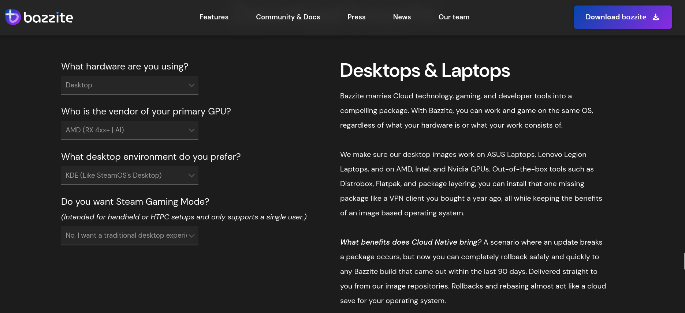
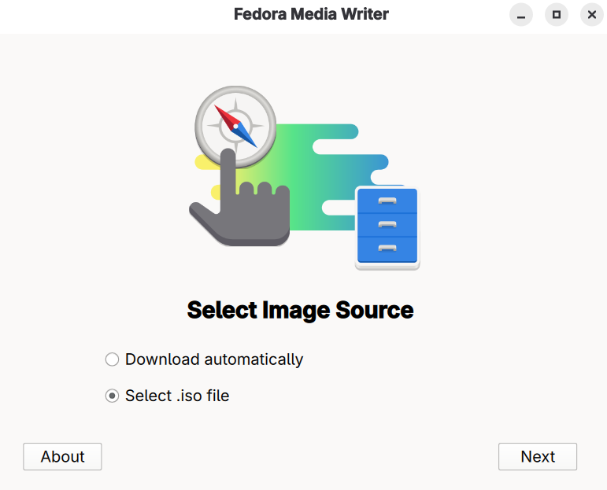
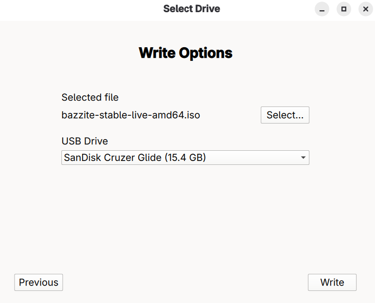
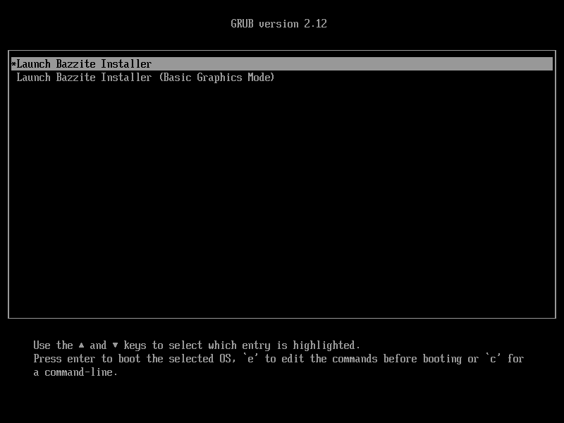
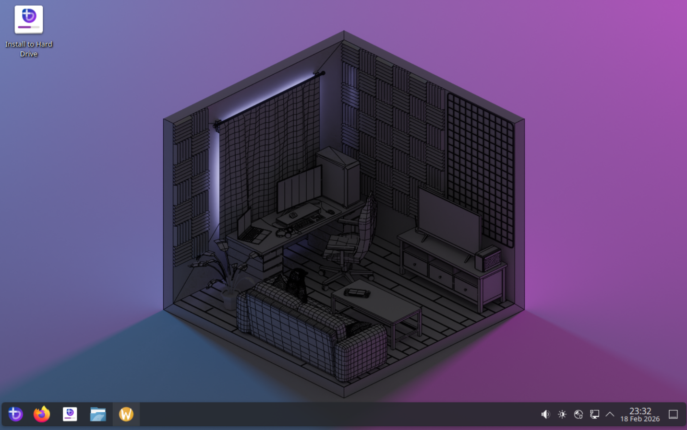
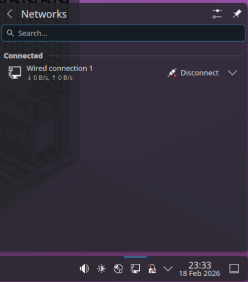
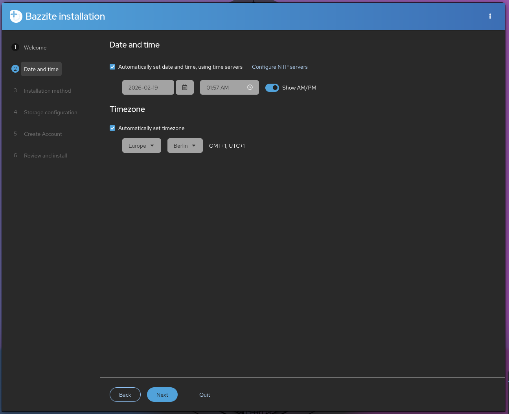
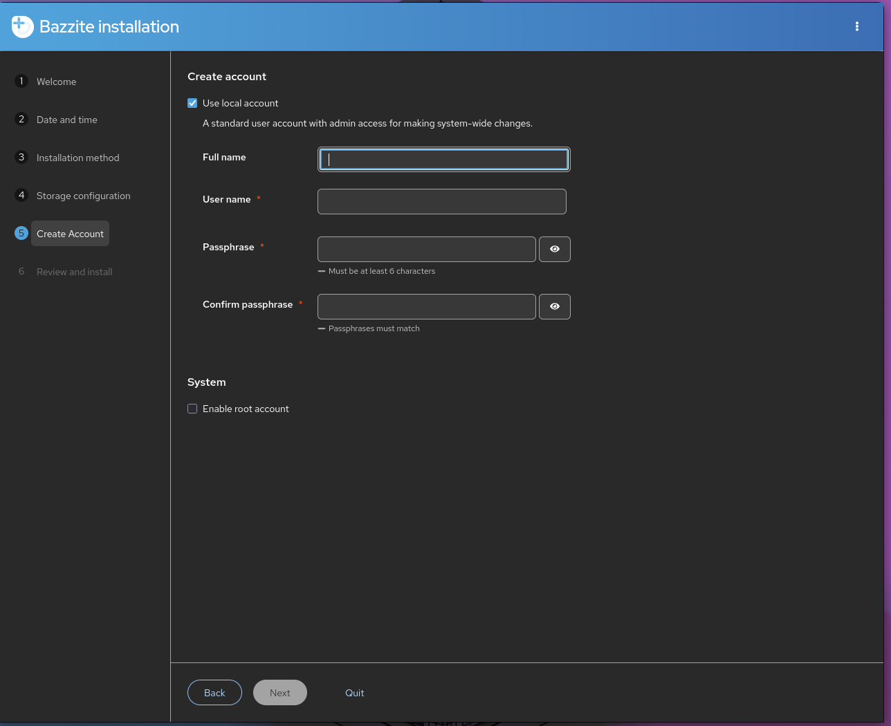
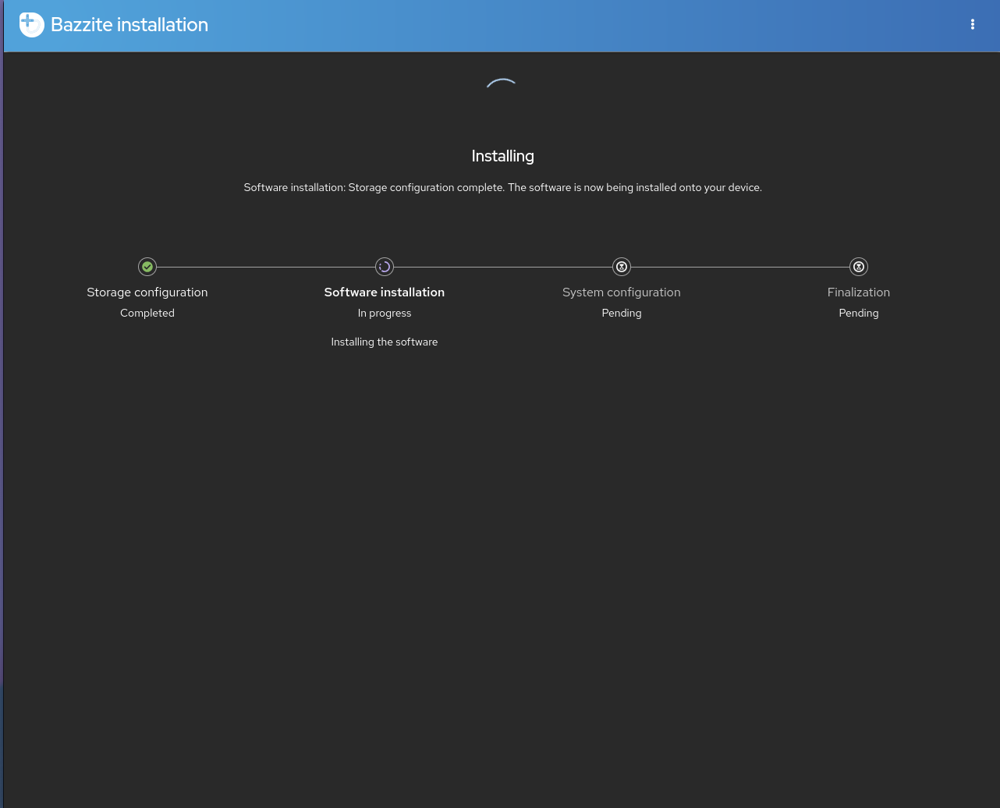
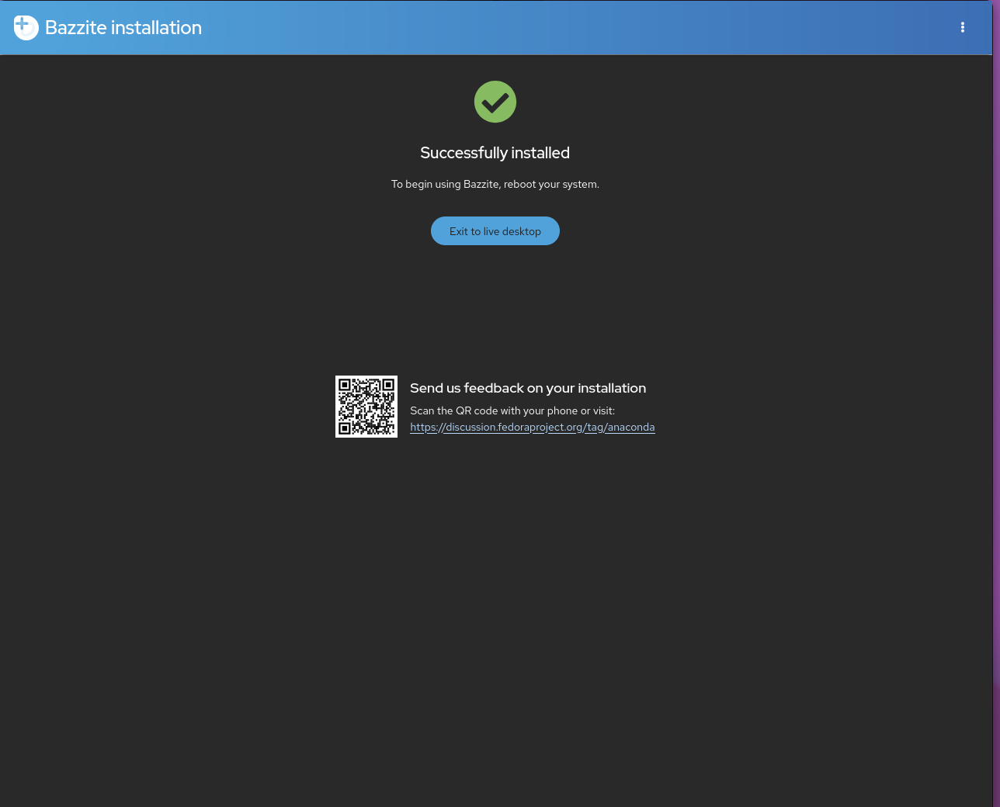

# Bazzite Installation Guide

## Video Walkthrough

<link Wolfyreload's video>

## System Requirements

- Read the [**Hardware Compatibility Guide**](./Gaming/Hardware_compatibility_for_gaming.md) for Bazzite's system requirements.
- Secure Boot and Trusted Platform Module (TPM) are supported on most hardware, but you must [**enroll our key during or after installation**](./secure_boot.md).

### Installer Requirements

- A way to download the Bazzite ISO
  - A download manager (like [**Motrix**](https://motrix.app/)) if the direct download for the Bazzite ISO fails or is downloading too slow.
- A 16GB+ bootable medium like a Flash Drive
  - Software to flash the ISO like **Fedora Media Writer** ([**Windows/macOS**](https://github.com/FedoraQt/MediaWriter/releases) or [**Linux**](https://flathub.org/en/apps/org.fedoraproject.MediaWriter))
- A physical wired keyboard is **recommended** and **required for devices without a touchscreen**.
  - Otherwise, create a User Account with a **username** and a **user password** if you have a keyboard.

### Desktop Environments

All of the images come with the choice of [**KDE Plasma**](https://kde.org/plasma-desktop/) or
[**GNOME**](https://www.gnome.org/) for their desktop environment.

[**Steam Gaming Mode**](https://github.com/KyleGospo/gamescope-session) is an option as an additional session to run on top of KDE Plasma or GNOME but is only recommended for Home Theatre PC (HTPC) and handheld setups.

More information can be found on our [**FAQ**](https://faq.bazzite.gg) about the differences between the image variants.

=== "KDE Plasma"

    #### [KDE Plasma (Default)](https://kde.org/plasma-desktop/)

    

    - KDE Plasma's default interface has a traditional and familiar layout
    - Highly customizable with tons of settings
    - Qt framework
    - Popular Linux distributions like SteamOS use KDE Plasma

=== "GNOME"

    #### [GNOME (`-gnome` images)](https://www.gnome.org/)

    

    - GNOME's default interface has an elegant and touch-friendly layout
    - Simple and concise
    - GTK framework
    - Popular Linux distributions like Ubuntu use GNOME

=== "Steam Gaming Mode"

    #### [Steam Gaming Mode (`-deck` images)](/Handheld_and_HTPC_edition/Steam_Gaming_Mode.md)

    

    !!! note

        Your device will automatically boot into the Steam Gaming Mode session at startup, and Desktop Mode can be accessed from the "**power menu**" in Steam Gaming Mode.

    

    - **Requires a [Steam](https://store.steampowered.com/) account**
    - Included in the [Bazzite-Deck images](/Handheld_and_HTPC_edition/Steam_Gaming_Mode.md)
    - Interface is designed for handheld and couch gaming
    - Controller friendly
    - Choice of KDE Plasma or GNOME as the Desktop Mode session
    - Extra functionality with [Decky plugins](https://github.com/SteamDeckHomebrew/decky-loader) [(See all plugins)](https://plugins.deckbrew.xyz/)

    

## Installation Walkthrough

### Download Bazzite

### Flash ISO

### Booting The Installer

#### GRUB Menu

#### Live Installer

#### Network 

Please note that an internet is not required to install Bazzite, but is useful if you're testing Bazzite before testing in the live environment.

#### Select Language, Region, and Keyboard Layout

#### Partitioning Options

!!! warning

    Make sure to only select the appropriate drives to avoid losing data on others, and it is best practice to safely remove any external drives before proceeding.

!!! note

     The "format as efi" button when dual-booting says it will format the Windows EFI, but what it actually does is add itself to the EFI. This is an upstream bug with the installer.

If you are dual-booting with Windows then read the [dualbooting guide](<link guide>).  Automatic partitioning is the only option available in the live ISO, but it should work for most people's dual-booting usecases.  If you require manual partitioning, then use the legacy ISO and follow the [manual partitioning guide](<link this>).

^^^this should be a comment but maybe just have dualboot guide here and have the other one be the legacy one? idk.... ahhhhhhh... maybe secure boot guide should part of this too?

#### User Account Setup

!!! warning

    It is not recommended to enable a root account.

### Installing Bazzite

Please wait for Bazzite to install.  This may take a while.

#### Reboot

## Post-Installation

Bazzite is now installed. Read the [**Post-Installation Guide**](<link guide>) for recommended next steps or start gaming!
