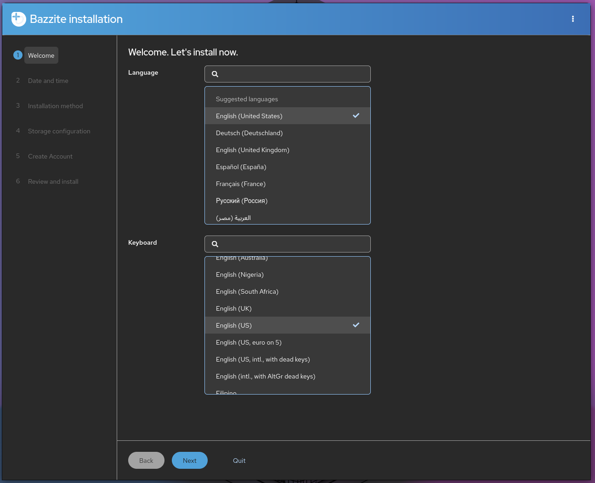
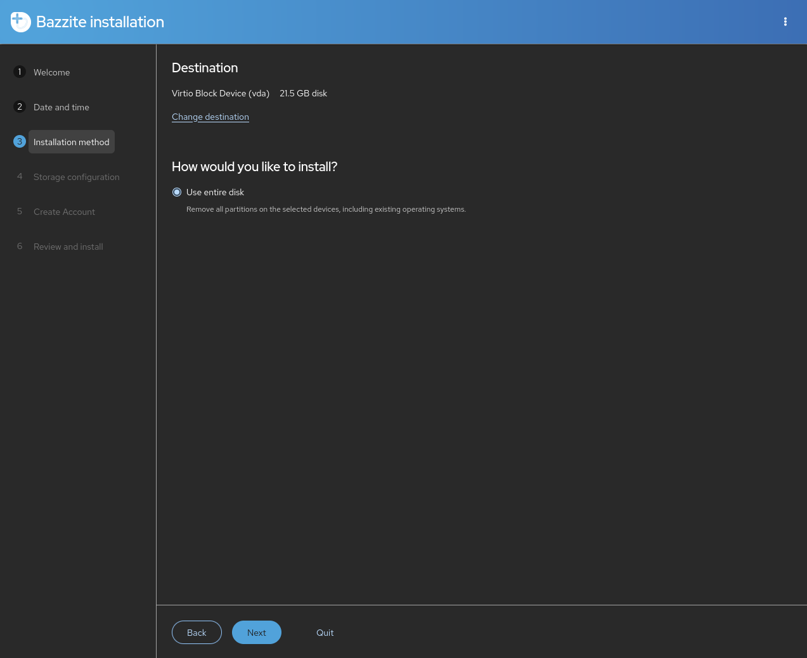
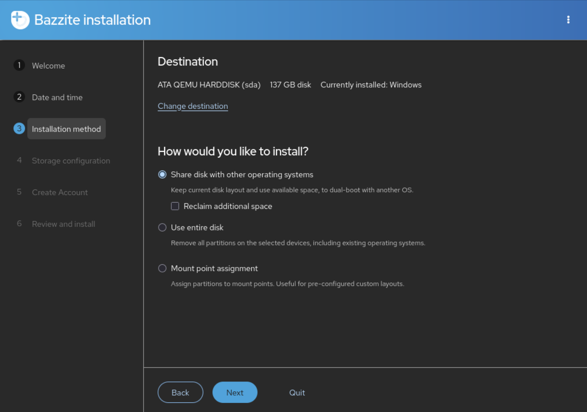
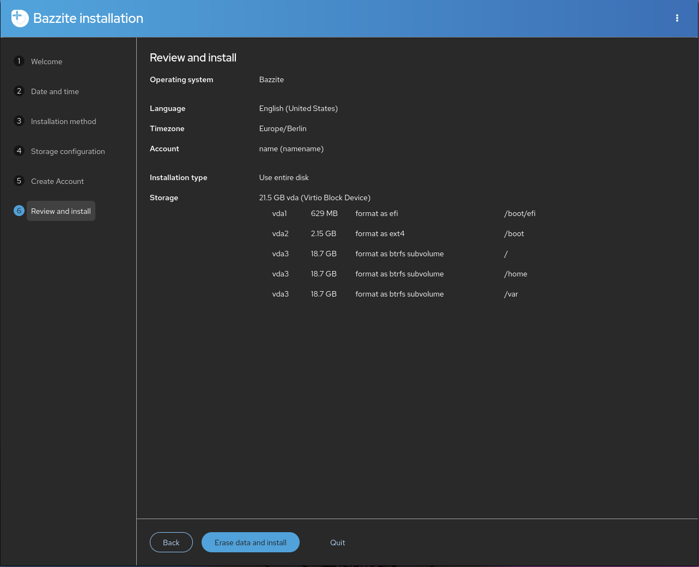

# Bazzite Installation Guide

## Video Walkthrough

<link Wolfyreload's video>

## System Requirements

- Read the [**Hardware Compatibility Guide**](./Gaming/Hardware_compatibility_for_gaming.md) for Bazzite's system requirements.
- **Secure Boot and Trusted Platform Module (TPM) are supported on most hardware**, but you must **enroll our key during or after installation**.

### Installer Requirements

- A way to download the Bazzite ISO
  - A download manager (like [**Motrix**](https://motrix.app/)) if the direct download for the Bazzite ISO fails or is downloading too slow.
- A 16GB+ bootable medium like a Flash Drive
  - Software to flash the ISO like **Fedora Media Writer** ([**Windows/macOS**](https://github.com/FedoraQt/MediaWriter/releases) or [**Linux**](https://flathub.org/en/apps/org.fedoraproject.MediaWriter))
- A physical wired keyboard is **recommended** and **required for devices without a touchscreen**.
  - Otherwise, create a User Account with a **username** and a **user password** if you have a keyboard.

### Desktop Environments

All of the images come with the choice of [**KDE Plasma**](https://kde.org/plasma-desktop/) or
[**GNOME**](https://www.gnome.org/) for their desktop environment.

[**Steam Gaming Mode**](https://github.com/KyleGospo/gamescope-session) is an option as an additional session to run on top of KDE Plasma or GNOME but is only recommended for Home Theatre PC (HTPC) and handheld setups.

More information can be found on our [**FAQ**](https://faq.bazzite.gg) about the differences between the image variants.

=== "KDE Plasma"

    #### [KDE Plasma (Default)](https://kde.org/plasma-desktop/)

    

    - KDE Plasma's default interface has a traditional and familiar layout
    - Highly customizable with tons of settings
    - Qt framework
    - Popular Linux distributions like SteamOS use KDE Plasma

=== "GNOME"

    #### [GNOME (`-gnome` images)](https://www.gnome.org/)

    

    - GNOME's default interface has an elegant and touch-friendly layout
    - Simple and concise
    - GTK framework
    - Popular Linux distributions like Ubuntu use GNOME

=== "Steam Gaming Mode"

    #### [Steam Gaming Mode (`-deck` images)](/Handheld_and_HTPC_edition/Steam_Gaming_Mode.md)

    

    !!! note

        Your device will automatically boot into the Steam Gaming Mode session at startup, and Desktop Mode can be accessed from the "**power menu**" in Steam Gaming Mode.

    

    - **Requires a [Steam](https://store.steampowered.com/) account**
    - Included in the [Bazzite-Deck images](/Handheld_and_HTPC_edition/Steam_Gaming_Mode.md)
    - Interface is designed for handheld and couch gaming
    - Controller friendly
    - Choice of KDE Plasma or GNOME as the Desktop Mode session
    - Extra functionality with [Decky plugins](https://github.com/SteamDeckHomebrew/decky-loader) [(See all plugins)](https://plugins.deckbrew.xyz/)

    

## Download Bazzite


<explain what each of these buttons mean for more context>

Download the Bazzite ISO of your choice. Choose the hardware you plan to install Bazzite on, the vendor of your primary GPU, the desktop environment of your choice, and if you want Steam Gaming Mode (Bazzite-Deck version of Bazzite intended for HTPC and handheld hardware).

### Calculating ISO SHA256 Checksum Hash

https://www.youtube.com/watch?v=wUDbMJtR1sM

## Flash ISO


## Booting The Installer

- Connect your bootable medium to your device and boot into it.
- After connecting the device, boot into the Bazzite installer.
- This depends on your motherboard hardware, but most of the time it could be a function keys like <kbd>F9</kbd> or similar.
  - Sometimes you need to consult the manual, look up your device online, or read any hotkeys that appear when you boot your PC.
    - Alternatively change the BIOS settings to boot with your bootable device first before your current storage, but this is **not recommended** to keep enabled after installing Bazzite.
- Verify the media correctly and proceed to the installer.

### Handheld Devices

Hold the 'Volume Down' (<kbd>-</kbd>) button and click the Power Button, and when you hear the chime, let go of both buttons, and you'll be booted into the Boot Manager. When you get to the boot menu, select your bootable device to boot into the Bazzite installer.

## GRUB Menu


Upon booting for the first time...

## Live Installer


Bazzite's live installer session lets you view the desktop applications pre-installed and get familiar with the UI/UX of it.  Please do not attempt to game on the live session since performance will not be accurate to when it is properly installed onto your drive.

## Network Setup


Please note that an internet is not required to install Bazzite, but is useful if you're testing Bazzite before testing in the live environment.

## Select Language, Region, and Keyboard Layout




#### Partitioning Options

!!! warning

    Make sure to only select the appropriate drives to avoid losing data on others, and it is best practice to safely remove any external drives before proceeding.




## Dual Booting



!!! note

    Skip this section if you plan to install Bazzite without dual-booting Windows.

!!! warning

     The "format as efi" button when dual-booting says it will format the Windows EFI, but what it actually does is add itself to the EFI. This is an upstream bug with the installer.

### Dual-booting other Linux operating systems

!!! note 

    Dual booting with **other Linux distributions**, especially **non-atomic Fedora**, is not officially supported. It is recommended to use your motherboard's UEFI boot menu or to forgo dual booting entirely to avoid unexpected issues. If something does go wrong, restore Bazzite's bootloader using the **Bootloader Restoring Tool** in the Live ISO.

For Fedora Atomic Desktop images on the **same** drive: to dual boot another **Fedora Atomic Desktop image** (like [Bluefin](https://projectbluefin.io/)) installed alongside Bazzite, you must make an additional EFI partition and switch between them through your motherboard's UEFI boot menu.

For dual booting on **separate** drives:

Use your motherboard's UEFI boot menu as the GRUB bootloader may not recognize each boot entry correctly.

If you are dual-booting with Windows then use automatic partitioning as it is the only option available in the live ISO, but it should work for most people's dual-booting usecases.  If you require manual partitioning, then download the legacy ISO and follow the [legacy ISO installation guide](<link this>).

1. Installing Bazzite with a shared drive.
2. Installing Bazzite on a separate drive.

=== "Shared Drive (Automatic Partitioning)"

    1. (In Windows) Disable **Bitlocker encryption** and **fastboot**, and reboot.
    2. (In Windows) Resize the Windows partition with the Disk Management app to have enough space for Bazzite.
    Usually should look something like this:
    ]
    <i><small>Source: [diskpart.com](https://www.diskpart.com/windows-10/windows-10-disk-management-0528.html)</small></i>
    3. Run the Bazzite installer with the automatic partitioning option.
    4. Reboot into Bazzite and run `ujust regenerate-grub` in the terminal to add Windows to the GRUB.

=== "Separate Drive"

    **When a dedicated drive is feasible, this method is recommended.**

    Install Bazzite on a separate internal or external drive.

    1. Install the other operating system on a drive (like Windows).
    2. Install Bazzite on a **second** drive.
    3. Set Bazzite as the **default** in your boot order (optional).

    If you install Windows second, you should disconnect the Bazzite drive to prevent using the Windows installer of using its EFI partition.

    You can also install Windows to an external drive with Windows-to-Go using [Rufus](https://rufus.ie/en/) to dual boot if you do not have an internal drive available.

## Disk Encryption


## User Account Setup


!!! warning

    It is not recommended to enable a root account.

An on-screen keyboard exists...

## Installing Bazzite

Please wait for Bazzite to install.  This may take a while.





## Reboot


## Secure Boot


!!! note

    Skip this section if Secure Boot is not enabled or unsupported with your hardware.

!!! important

    The enrollment prompt uses a English QWERTY keyboard layout, indiscriminately of your actual hardware keyboard. Other layouts can therefore interfere with the characters of the password (i.e. `A` and `Q` are swapped on AZERTY layouts).

Bazzite supports Secure Boot however Universal Blue's key must be enrolled to use it otherwise keeping Secure Boot on in your BIOS will result in Bazzite not booting.

- Entering the password will register invisible characters for security purposes, so you will not be able to see what you are typing!

- Updating your BIOS may re-enable Secure Boot and you may have to follow **"Method B"** after updating it to resolve the black screen on boot complaining about loading the kernel first.

- The Steam Deck does **not** come with secure boot enabled and does not ship with any keys enrolled by default, do not enable Secure Boot on your Steam Deck unless you absolutely know what you're doing.

### Error Message (if key is **not** enrolled properly):

```
error: ../../grub-core/kern/efi/sb.c:182:bad shim signature.
error: ../../grub-core/loader/1389/efi/linux.c:256:you need to load the kernel first.

Press any key to continue...
```

Follow **Method B** below to resolve this and move past the error message if you encounter it.

### Using Secure Boot with Bazzite

#### **Method A** - During Installation Method (See Image Above)

!!! note

    This screen will also appear on the next boot if you enable Secure Boot if it was disabled during installation.

A blue screen will appear giving the option to enroll the signed keys after leaving the Bazzite installer.

`Enroll MOK` if you have secure boot enabled. If prompted to enter a password, then **enter**:

```command
universalblue
```

Otherwise `Continue boot` if you have Secure Boot disabled or if it is not supported with your hardware.

#### **Method B** - After Installation Method

**Disable Secure Boot in the BIOS before proceeding**, and then re-enable it **after enrolling the key**.

If you have already installed Bazzite then **enter this command in a host terminal**:

```
ujust enroll-secure-boot-key
```

If prompted to enroll the required key, then **enter the password in the host terminal**:

```command
universalblue
```

**You can now turn Secure Boot back on in the BIOS.**
Use the following command to boot straight into your system's BIOS (if supported):

```command
ujust bios
```
### Complete MOK enrollment at boot

On the next boot, you will see the blue MokManager screen:

1.  Choose **Enroll MOK**.
2.  When prompted for a password, enter:
    ```command
    universalblue
    ```

After the reboot, the key is enrolled and Secure Boot can remain enabled. Your system should now boot normally under Secure Boot.

## **Troubleshooting Installation**:

Read the [**Troubleshooting Guide**](./troubleshoot_guide.md) or the [**Alternative Installation Guide**](./alternate-install-guide.md) for installation workarounds.

## Post-Installation

Bazzite is now installed. Read the [**Post-Installation Guide**](<link guide>) for recommended next steps or start gaming!


