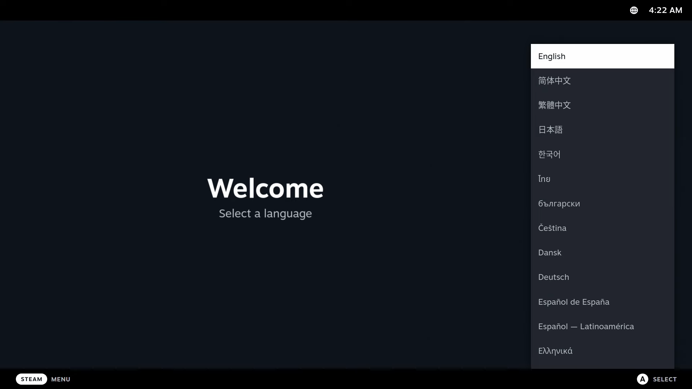

# Post-Installation Setup

## First Boot Setup


The first boot will show a screen showing your current and last deployment. It is important to note that the GRUB menu can be used to rollback Bazzite deployments if you encounter issues.

Read more about this in the [**Updates, Rollback, and Rebasing documentation**](../../Installing_and_Managing_Software/Updates_Rollbacks_and_Rebasing/index.md).

It is important to configure the system settings on a first boot to personalize your desktop especially if you notice the scaling is incorrect on first-boot.

## Setting Up Steam Gaming Mode (Bazzite-Deck Images Only)



If you selected to use Steam Gaming Mode before downloading the ISO, then you will be on the Bazzite-Deck version.  After completing all of the above, then your next boot will be in Steam Gaming Mode which requires additional setup for Steam.

>[Read the **Bazzite-Deck documentation**](../../Handheld_and_HTPC_edition/index.md) for more information on the HTPC/Handheld images.

## Configure System Settings

Open the system settings application in the desktop session to start configuring settings ranging from personalization like wallpapers to power management.

### Scaling Settings


**_KDE Plasma's System Settings application_**


**_GNOME's Settings application_**

Adjust the system settings to your preference.

### Changing Default Password
<sub> (If it wasn't changed in the legacy ISO installer) </sub>


Change it in the settings of Desktop Mode under the "User" category.

## Dual Boot Post-Configuration Setup

Show both your Windows and Bazzite installations in the GRUB menu to select from at boot by entering this **command into the terminal**:

```
ujust regenerate-grub
```

#### Bazzite as Primary Boot

If the `OS Boot Manager` has set `Windows Boot Manager` to be the first boot priority, then this may result in booting directly into Windows after the install instead of Bazzite. You may have to fix this in your BIOS settings.

Take note that the GRUB menu might not show up. In such case, spam the <kbd>↓</kbd> key when booting up.

#### Boot into Windows from Steam

Adds a script in Steam to boot into Windows.

```
ujust setup-boot-windows-steam
```

#### Expanding storage size in a Windows dual-boot scenario

!!! note

    This is for future reference after dual-booting for a while.

**Watch this video tutorial on how to expand the storage**:

https://www.youtube.com/watch?v=uy8mi1pAj8E

## Recommended Next Steps

### Configure your system with the Bazzite Portal application


Familiarize yourself with the Bazzite Portal which does system maintenance, install a small subset of additional applications, and configure advanced system settings.

### Install additional software with the Bazaar app store


Install additional software for Bazzite in the Bazaar app store.  This is the place where you will be getting most of your applications, but if you require something that isn't found here then look into the [**Installing and Managing Applications**](../../Installing_and_Managing_Software/index.md)

### Ready to Game!

Enjoy using Bazzite!  Read the [**Gaming Guide**](../../Gaming/index.md) to learn the basics of Linux gaming.
