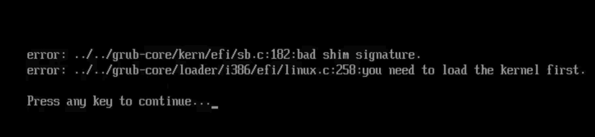

# Installation Troubleshooting

## Error Code 1

The "code 1" error is a generic error code that appears during installation when a more specific error message isn't available. This error can occur in several scenarios that we have identified so far but there may be more scenarios:

- **Existing Linux Installation:** If you've previously installed another Linux on the same drive, the installer might fail when installing the bootloader with a 'bootloader write config' error.
  - This can happen even if the previous Linux installation is no longer functional. It is known to occur with both **Fedora-based** (Fedora, Fedora Atomic, Bazzite, Nobara, etc.) and **Ubuntu-based** (Ubuntu, Mint, PopOS, etc.) distros.
  - **Fix 1:** Separate drive: If your hardware supports more than 1 SSD, install Bazzite on a different drive that has not seen Linux before.
  - **Fix 2:** Manually remove the existing Linux from the EFI: The video below explains one way to resolve this for a previous Fedora installation.   https://www.youtube.com/watch?v=GRdz08hJByo   In summary, you'll need to access the terminal, identify and mount the EFI system partition, remove the existing "Fedora" folder.
    - This can be adapted to work with Ubuntu-based OSes by removing the 'ubuntu' folder instead of the 'fedora' folder
  - **Fix 3:** Delete the existing EFI partition on the drive: If you are NOT planning on dual-booting, use GParted or Disks to remove the existing EFI.
    - **Warning:** This is **irreversible** and will remove every other operating system on the drive, **including Windows**
  - **Fix 4:** Create a new EFI partition: You can use manual partitioning as described in the [Manual Partitioning Guide](./manual_partitioning.md) to create a new EFI partition alongside the existing one to accomplish this.
    - Warning: some BIOSes cannot handle a second EFI partition on the drive.
- **Incorrect Filesystem:** Using the EXT4 or any other filesystem type for the root partition will cause this error. You must use BTRFS for the root partition.
- **Corrupted ISO Image:** Ensure the ISO image isn't corrupted by calculating the checksums or using the official torrent when downloading Bazzite.
- **Overheating USB Flash Drive:** Use a USB 3.0 or better flash drive and plug it into a USB 3.0 or better port to avoid overheating.

## "Device is Active" Error

This error occurs when the installer encounters a BitLocker encrypted partition. You have two possible options:

A. **If Dual Booting:** Shrink the partition in Windows before installing, enough to have enough room for a Bazzite install.
B. **Bazzite Only:** Delete the BitLocker partition using a tool like GParted before installing.

**Watch this video for a demonstration**:

https://www.youtube.com/watch?v=FBGLLkIKp-w

## "Error checking storage configuration"

**Watch this video for a workaround**:

https://www.youtube.com/watch?v=VTnm9EiBdPA

## "Bad shim signature, you need to load the kernel first" error

Disable Secure Boot in BIOS to get past this screen. If you wish to use Secure Boot, follow [the **Secure Boot Guide** using method B](/General/Installation_Guide/secure_boot.md)

Video walkthrough: https://www.youtube.com/watch?v=Z_DsWqTuipU

## "Failed to open \EFI\BOOT\mmx64.efi - Not Found" error

To work around this issue, boot from file. Go into your UEFI (BIOS), select your EFI partition with Bazzite installed, then select /EFI/fedora/grubx64.efi to boot from.
After this, your boot manager should boot normally showing "FEDORA" as the option.

>[**Secure Boot Guide**](/General/Installation_Guide/secure_boot.md)

## Unable to allocate requested partition scheme error

This error occurs when installing on drives larger than 2TB where the first 2TB or more is already occupied by one or more partitions. The image below illustrates the error message.

It seems like the Anaconda installer cannot create any paritions after the 2TB mark.

Here are some possible solutions on how you can address it:

- Install Bazzite on a different storage device where Bazzite can have the entire drive.
- If you're dual booting with Windows, reduce the size of your Windows partition to under 2TB. If Windows' Disk Management can't do this, consider using a third-party tool like [EaseUS Partition Master](https://www.easeus.com/partition-master/) to resize the partitions while Windows is not running.
- If the drive contains no important data, you can delete all existing partitions and restart the installation process.

## Alternative Installation Method

!!! note

    **The alternative installation method is useful for downloading a smaller ISO and may resolve other issues, but also contains display issues in the installer on most handheld displays**.

If none of the above errors are relevant to your issue, or you still have problems installing Bazzite, then try following our alternative installation method:

[**Try installing Bazzite by rebasing from Fedora Kinoite (KDE Plasma) or Fedora Silverblue (GNOME)**](/General/Installation_Guide/alternate-install-guide.md).
