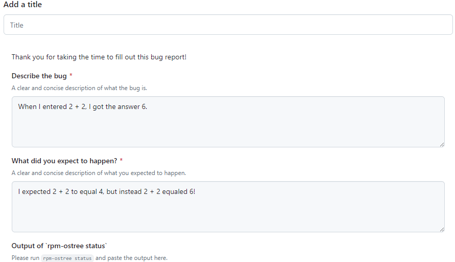

# Reporting Bugs

## Submit bug reports in the appropriate place

Report bugs experienced with Bazzite in our [**issue tracker**](https://github.com/ublue-os/bazzite/issues)! We discourage reporting bugs in the Discourse forums since reports can get lost or may not be viewed by Bazzite contributors as often as the issue tracker.

## **Bazzite Issue Template Walkthrough**




## Update Bazzite before reporting

Sometimes bugs are fixed during upgrades, so try updating and rebooting your device before submitting a report to see if the issue still persists between updates.

>**Read how to update Bazzite for your device**:
>[**Updating guide**](../Installing_and_Managing_Software/Updates_Rollbacks_and_Rebasing/updating_guide.md)

## Make sure to attach system logs

Open a host terminal and **enter**:

```
ujust device-info
```

Attach the link that it outputs for system logs.

## Experience system crashes?

```command
ujust logs-last-boot
```
Copy the output inside of the bug report. 
