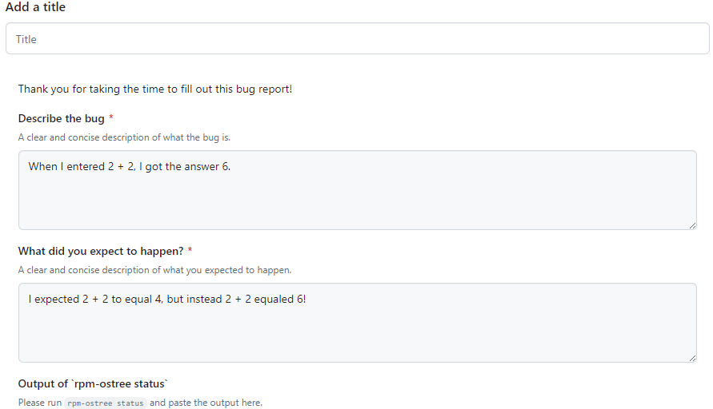

# 提交Bug報告

## 在合適的地方提交Bug報告

Bug 報告應於 Bazzite 的[**issue tracker**](https://github.com/ublue-os/bazzite/issues)提交。請避免在 Bazzite Discourse 上提交 Bug 報告，因它們或有機會被遺忘或遺失。

如你不肯定你遇到的是否為 Bug ，你可以試試在 [Bazzite Discord 伺服器]((/community/#discord-no-discord-account))的 #bazzite-help 頻道詢問。

!!! 溫馨提示

    請使用英文提交Bug報告！若你不擅長英文，請仍然盡量以英文書寫而不要使用LLM翻譯。倘若你在書寫英文Bug報告時遇到困難，你可以試試在Issue裏加入原文及[Needs Translation]，社區成員或會幫助你翻譯。

## Bazzite Issue 範本




## 在提交報告之前更新Bazzite

Bazzite 有機會在更新中修復你所遇到的Bug。為避免重複的Bug報告，在提交報告前請務必更新Bazzite，並確認你遇到的Bug在更新前後均可複現。

>**如何更新 Bazzite?**
>[**關於系統更新與回溯**](../Installing_and_Managing_Software/Updates_Rollbacks_and_Rebasing/updating_guide.md)

## 謹記附上系統日誌

打開系統終端（Terminal），並輸入以下指令：

```
ujust device-info
```

複製其輸出的連結到你的 Bug 報告中。

## 系統炸了？

```command
ujust logs-last-boot
```

複製其輸出的一大串系統日誌到你的 Bug 報告中。

!!! 溫馨提示 "你亦可將其儲存於附件文檔中"
