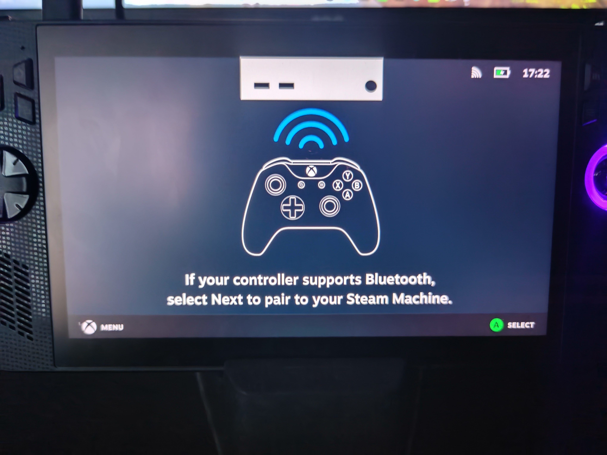
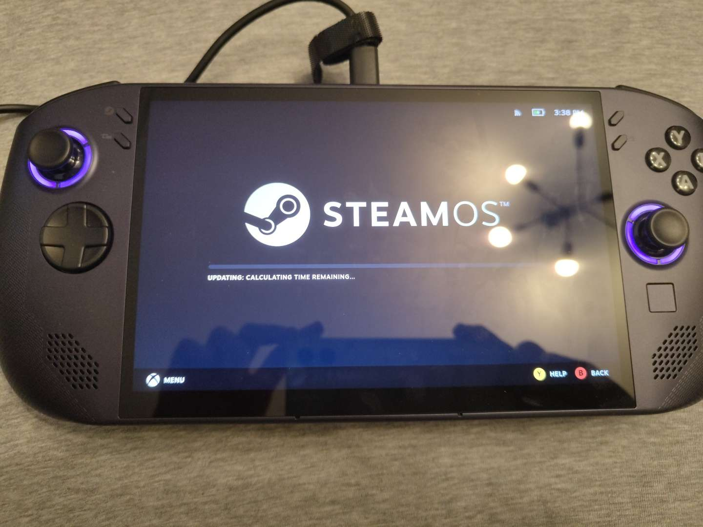

# Steam 遊戲模式的常見問題與解決辦法 

## 如何在 Bazzite 中使用於 SteamOS 中格式化的 microSD 卡？

打開系統終端並輸入以下指令：

```bash
ujust switch-to-ext4
```

---

## 我如何在 Steam 遊戲模式中設置正確的顯示屏幕？（僅限 HTPC／家庭影院）

在桌面模式中，打開系統終端並使用以下**指令**以尋找你的屏幕接口名稱：

=== "KDE"

    ```bash
    kscreen-doctor -o
    ```

=== "GNOME"

    ```bash
    gnome-randr
    ```
    !!! 溫馨提示

        當使用 `gnome-randr` 時，部分系統或未能正確顯示屏幕接口名稱。你可以執行以下指令，以列出所有已連接輸出的名稱（不含詳細資訊），其後將其與前一則指令的輸出結果進行比對，以找出實際屏幕接口名稱。
    
        ```bash
        grep -r '^connected' /sys/class/drm/*/status | grep -Po 'card.?-\K([^/]*)'
        ```
在尋找正確的屏幕接口名稱後，你可創建一個新的設置檔以設置 Steam 遊戲模式使用正確的屏幕輸出。

=== "使用 GUI"

    在桌面模式或 Steam Nested Desktop中，

    1. 若其尚未存在，建立 `~/.config/environment.d` 文件夾。

    2. 若其尚未存在，在上述文件夾下建立名為 `10-gamescope-session.conf` 的檔案。

    3. 將以下這行加入該檔案：
        `OUTPUT_CONNECTOR=DP-1`
    !!! info "記得將 `DP-1` 改為你的屏幕接口名稱！"

    4. 儲存檔案，然後重新啟動，並確認你的裝置是否已輸出至正確的顯示器。

=== "使用指令行"
    
    使用以下指令創建設置檔：
    
    !!! info "記得將下文的 `DP-1` 修改為你的屏幕接口名稱！"
    
    ```bash
    mkdir -p ~/.config/environment.d
    echo "OUTPUT_CONNECTOR=DP-1" >> ~/.config/environment.d/10-gamescope-session.conf
    ```

---

## 預設裝置無聲音輸出

此問題一般發生在 HDMI 電視音訊系統上。請切換至桌面模式，並在系統設定中停用與你目前使用的音訊輸出不符的裝置。

!!! info "常見的解決方法是將電視音訊設定為僅啟用 HDMI 輸出，並停用其他所有選項。"

---

## 於 Steam 遊戲模式中更改鍵盤佈局

Steam 遊戲模式暫未有變更實體鍵盤佈局的方式，而其預設為 US 佈局。若要變更佈局，你可以透過環境變數進行全域設定。

=== "使用 GUI"
    
    在桌面模式或 Steam Nested Desktop中，

    1. 若其尚未存在，建立 `~/.config/environment.d` 文件夾。

    2. 若其尚未存在，請在上述文件夾下建立名為 `10-gamescope-session.conf` 的檔案。

    3. 將以下這行加入該檔案，及將 `us` 更改為你的鍵盤佈局。
        `XKB_DEFAULT_LAYOUT=us`
        
    !!! info 
    
        佈局名稱通常為 [2 位字母的國家代碼](https://zh.wikipedia.org/wiki/ISO_3166-1%E4%BA%8C%E4%BD%8D%E5%AD%97%E6%AF%8D%E4%BB%A3%E7%A0%81#%E6%AD%A3%E5%BC%8F%E5%88%86%E9%85%8D%E4%BB%A3%E7%A2%BC)，
        此外，你也可以使用以下其中一個指令，查看鍵盤佈局清單（不含説明）：

        -   `localectl list-x11-keymap-models`
        -   `localectl list-x11-keymap-layouts`
        -   `localectl list-x11-keymap-variants [layout]`
        -   `localectl list-x11-keymap-options`
    
    4. 儲存檔案，然後重新啟動，並確認你的裝置是否已使用正確的鍵盤佈局。
    
=== "使用指令行"
    
    使用以下指令創建設置檔，及將 `us` 更改為你的鍵盤佈局。
    
    ```bash
    mkdir -p ~/.config/environment.d
    echo "XKB_DEFAULT_LAYOUT=us" >> ~/.config/environment.d/10-gamescope-session.conf
    ```

    !!! info 
    
        佈局名稱通常為 [2 位字母的國家代碼](https://zh.wikipedia.org/wiki/ISO_3166-1%E4%BA%8C%E4%BD%8D%E5%AD%97%E6%AF%8D%E4%BB%A3%E7%A0%81#%E6%AD%A3%E5%BC%8F%E5%88%86%E9%85%8D%E4%BB%A3%E7%A2%BC)，
        此外，你也可以使用以下其中一個指令，查看鍵盤佈局清單（不含説明）：

        -   `localectl list-x11-keymap-models`
        -   `localectl list-x11-keymap-layouts`
        -   `localectl list-x11-keymap-variants [layout]`
        -   `localectl list-x11-keymap-options`

!!! 溫馨提示

    此解決辦法在桌面模式下同樣適用，包括使用 Nested Gamescope 或 Nested Desktop 時，但它亦有其自身的特殊情況，如：

    -   在挪威語鍵盤佈局下，儘管基本的鍵盤佈局可用，按下 <kbd>altgr</kbd> + <kbd>2</kbd> 來輸入 `@` 仍無法正常運作。所幸，在挪威語鍵盤佈局下進行一般打字時，並不需要使用 <kbd>altgr</kbd> 鍵。
    -   據回報，<kbd>altgr</kbd> 鍵在法語鍵盤佈局下可正常運作
    -   不同鍵盤佈局下的實際效果可能有所差異。

---

## 我應如何關閉特定對 Steam Deck 的優化？

**此方法適用之情況**：

-   某遊戲的鍵盤和滑鼠無法正常運作。

-   用於調整視訊設定或安裝模組的遊戲啟動器無法啟動。

-   某些遊戲內本應可用的功能／畫質選項無法使用。

請在 Steam 上開啟遊戲的內容列表，並[**新增此啟動選項**](/zh_HK/Gaming/launch-options-env-variables/#_4)：

```bash
sd0 %command%
```

> 按[此](/zh_HK/Gaming/launch-options-env-variables/)獲取更多關於啟動選項與環境函數的訊息

---

## 為何有些 Decky Loader 插件無法在 Bazzite 上運作？

某些插件是專為 SteamOS 或 Steam Deck 設計的，因此未必能在 Bazzite 或其他非 Steam Deck 硬體上運作。

-   以[ DeckMTP ](https://github.com/dafta/DeckMTP)為例，其僅適用於 Steam Deck 機型，而無法在其他硬體上運作。

---

## 我如何於非 Steam Deck 裝置上使用 SteamDeckGyroDSU？

正式來説，你一般無法在 Steam Deck 以外的裝置上使用 SteamDeckGyroDSU，但視您的硬體配置和使用情境而定，你可嘗試關閉 Steam Input，而 SteamDeckGyroDSU _或_ 能運行。

---

## 我的「回到遊戲模式」（Return to Gaming Mode）捷徑消失了

你可以打開系統終端並運行以下指令以重新創建此捷徑：

```bash
ujust restore-gamemode-shortcut
```

---

## 啟動後進入 Steam 遊戲模式時長時間黑屏

如果你的裝置

-   在 Bazzite 旋轉圖示後出現黑屏，
-   無法連上網路，
-   發現 Steam 顯然正因網路連線中斷或速度過慢而嘗試更新但失敗；

跟隨[此處](/zh_HK/Handheld_and_HTPC_edition/quirks/#_2)之解決辦法。

---
 
## 我卡在這個畫面上了

!!! info "以下解決辦法亦適用於[啟動後進入 Steam 遊戲模式時長時間黑屏](/zh_HK/Handheld_and_HTPC_edition/quirks/#steam_2)。"



1.  使用此**快捷鍵**，透過 **外接實體鍵盤** 開啟 TTY 連線：
    <kbd>Ctrl</kbd>+<kbd>Alt</kbd>+<kbd>F4</kbd>
2.  登入你的使用者帳戶
3.  輸入以下指令：
```bash
steamos-session-select desktop
```
4. 在桌面模式中登入 Steam ，然後重啟裝置

---

## 系統顯示 'Update calculating: Time Remaining'



重啟裝置。

---

## Steam 客戶端與遊戲模式都崩潰了

跟隨[此處](/zh_HK/Handheld_and_HTPC_edition/quirks/#bazzite)之解決辦法。

---

## "Something went wrong while displaying this content" 錯誤

這很可能是安裝的 Decky Loader 插件出現故障所致，而只需卸載該故障插件即可解決此問題。

!!! 溫馨提示 "某些 CSS Loader 主題亦有機會引致此問題。"

---

## Rainbow Display


在快捷選單（QAM）中切換並重啟 HDR（高動態畫面）。

!!! note "您可能還需要額外啟用「開發者選項」中的「Force Composite」設定，且「開發者選項」功能必須事先在 Steam 設定中啟用。"

---

## 系統卡於 Bazzite 標誌並無法進入遊戲模式

!!! info "以下解決辦法亦適用於[Steam 客戶端與遊戲模式都崩潰了](/zh_HK/Handheld_and_HTPC_edition/quirks/#steam_3)。"

=== "使用桌面模式"

    打開 Bazzite Portal → Troubleshoot → Reset Steam installation，然後重啟裝置。

=== "使用 TTY (_若你無法進入桌面模式_)"

    使用 <kbd>Ctrl</kbd>+<kbd>Alt</kbd>+<kbd>F4</kbd> 開啟 TTY 連線，並以你的 Bazzite 用戶名及密碼登入，然後輸入以下指令：
    
    !!! info "若你未於安裝時設定用戶名及密碼，兩者將皆預設為`bazzite`。"

    ```bash
    ujust fix-reset-steam
    ```
    然後使用以下指令重啟裝置：
    
    ```bash
    systemctl reboot
    ```

=== "後備辦法"

    !!! 警告

        在使用以下辦法之前，請務必先嘗試重新啟動你的裝置！若操作不當，可能會導致遊戲、存檔及其他內容遺失。

    1.  使用 <kbd>Ctrl</kbd>+<kbd>Alt</kbd>+<kbd>F4</kbd> 開啟 TTY 連線，並以你的 Bazzite 用戶名及密碼登入，然後輸入以下指令：
    ```bash
    mv ~/.local/share/Steam ~/.local/share/Steam.bak
    ```

    2.  此指令會將 `Steam` 文件夾重新命名至 `Steam.bak`。在重新啟動 Steam 後， Steam 將自動重新創建 `Steam` 文件夾。
    3.  若你曾於內置硬盤中安裝遊戲，你便可將安裝於 `Steam.bak` 的遊戲複製至新的 `Steam` 文件夾中。
    4.  使用 <kbd>Ctrl</kbd>+<kbd>Alt</kbd>+<kbd>F2</kbd> 關閉 TTY 連線

> 你可參考此影片：
https://www.youtube.com/watch?v=gE1ff72g2Gk

---

## Nvidia 顯卡於 Steam 遊戲模式中的各種問題

-   **在網頁瀏覽中使用 GPU 加速彩現（需要重新啟動）**必需為開，否則 Steam 遊戲模式的介面將龜速運行。
    -   此設置或會導致嚴重畫面瑕疵如花屏、閃躍、圖形錯誤等。
-   高動態範圍顯示模式或會導致嚴重畫面瑕疵如花屏、閃躍、圖形錯誤等。
