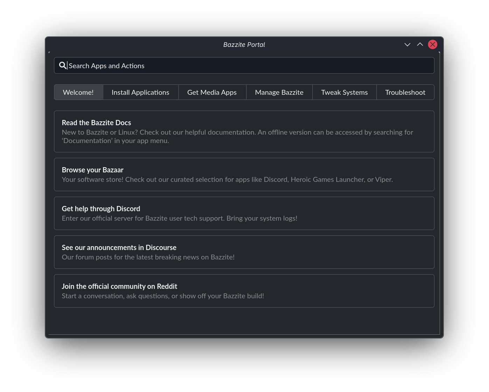
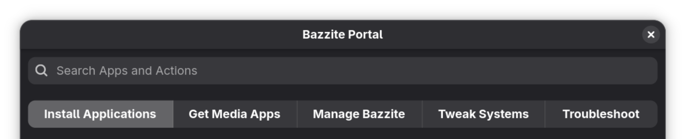
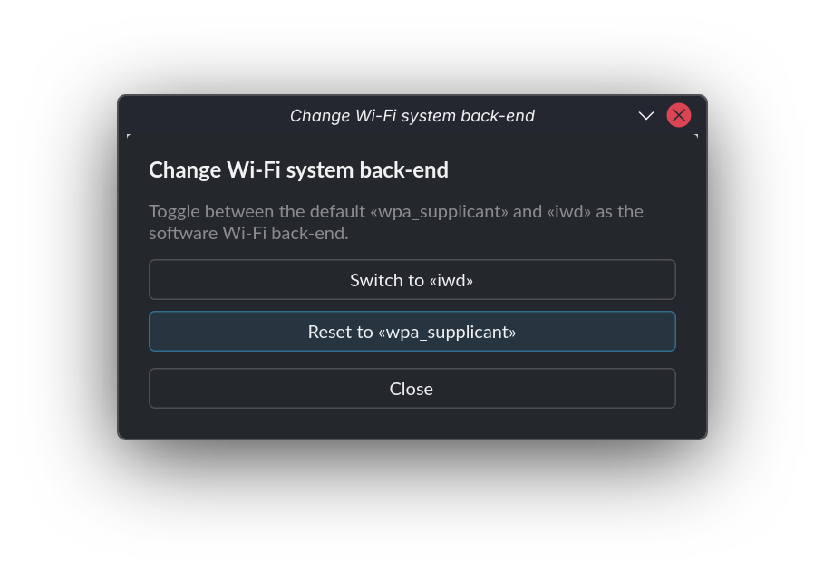

---  
title: Bazzite Portal  
---



## Overview

The Bazzite Portal is a configuration tool that uses [`ujust`](./ujust.md) commands to enable features, install system updates, install specific packages, and troubleshoot system issues:

- Installs useful tools like [Decky](https://github.com/SteamDeckHomebrew/decky-loader), [OpenRGB](https://github.com/calcprogrammer1/openrgb), and [Waydroid](https://github.com/waydroid/waydroid).
- Uses [`topgrade`](https://github.com/topgrade-rs/topgrade) to install updates for multiple package managers, including Bazzite, Flatpak (Bazaar), firmware (`fwupdmgr`), and Brew.
- Installs Homebrew apps from the [Universal Blue tap](https://github.com/ublue-os/homebrew-tap), and adds web apps for various streaming services.
- Gathers system logs, rolls back system updates, resets Bazzite to its default configuration, or rebases your system to a different version.

!!! tip "Want to know more?"

    To learn about the Bazzite Portal's internal workings, see [How the Bazzite Portal works](#how-the-bazzite-portal-works).
  
## Launching Bazzite Portal

The Bazzite Portal is installed by default. To launch the app:

=== "KDE Plasma"

    1\. Click **Application Launcher** in the bottom-left corner.
    2\. Click **System**.
    3\. Click **Bazzite Portal**.

=== "GNOME"

    1\. Click the **Activities** button in the top-left corner.
    2\. Click **App Grid**.
    3\. Type in "Bazzite".
    4\. In the search results, click **Bazzite Portal**.

## Configuration settings

The Bazzite Portal's features are organized into categories:



Below are a list of non-exhaustive previews, containing select entries of each category.

<hr>

### Welcome!

This category provides essential resources, community links, and documentation to help new users get started with Bazzite.

| Feature | Description | Script Command |
| :--- | :--- | :--- |
| **Read the Bazzite Docs** | Opens the official online Bazzite documentation. | `xdg-open https://docs.bazzite.gg/` |
| **Browse your Bazaar** | Opens instructions and launches the Bazaar software store. | Custom script launching Bazaar |
| **Get help through Discord** | Opens the official Bazzite Discord server for technical support. | `xdg-open https://discord.gg/JQq48bYzrc` |
| **See our announcements in Discourse** | Links to Discourse forum announcements for breaking Bazzite news. | `xdg-open https://universal-blue.discourse.group/tags/c/bazzite/announcements/` |
| **Join the official community on Reddit** | Opens the official Bazzite subreddit. | `xdg-open https://www.reddit.com/r/Bazzite/` |

<hr>

### Install Applications

This category offers software packages, development toolchains, gaming plugins, and hardware management utilities that can be installed using Homebrew, Distrobox, or native scripts.

| Feature | Description | `ujust` Command |
| :--- | :--- | :--- |
| **Android Platform Tools** | Command-line tools for interfacing with the Android OS (via Brew). | Brew cask script |
| **Antigravity** | AI-powered IDE from Google (via Brew). | Brew cask script |
| **asusctl & ROG Control Center** | Utilities for management of ASUS hardware. | `asus` |
| ... | ... | ... |
| **Visual Studio Code** | Open source code editor and debugger from Microsoft (via Brew). | Brew cask script |
| **VSCodium** | Open source community edition of Visual Studio Code (via Brew). | Brew cask script |
| **Waydroid** | Android container compatibility layer for Linux. | `configure-waydroid` |

<hr>

### Media Applications

This category installs web apps for various gaming and video streaming services, such as Spotify and Youtube. 

This integration lets you run the web app directly from your Steam library. For example:


<hr>

### Manage Bazzite

This category lets you update your system and do advanced troubleshooting. You can gather system logs, rollback system updates, reset Bazzite to its default configuration, or rebase your system to a different version.

- **Update Bazzite and Apps**: See the [Update Guide](Updates_Rollbacks_and_Rebasing/updating_guide.md).
- **Rebase Bazzite** (_stable_ and _testing_): See the [Rebase Guide](Updates_Rollbacks_and_Rebasing/rebase_guide.md).
- **Rollback Bazzite**: See [Rollbacks](Updates_Rollbacks_and_Rebasing/rolling_back_system_updates.md) and [Bazzite Rollback Helper](Updates_Rollbacks_and_Rebasing/bazzite_rollback_helper.md).

| Feature | Description | `ujust` / Script Command |
| :--- | :--- | :--- |
| **Update your system** | Update Bazzite, Flatpak apps, and system components. | `update` |
| **Move to stable track** | Rebase system to the `stable` Bazzite image tag. | `brh rebase stable -y && reboot` |
| **Move to testing track** | Rebase system to the `testing` Bazzite image tag. | `brh rebase testing -y && reboot` |
| ... | ... | ... |
| **Manage GRUB menu visibility** | Configure GRUB visibility during system boot sequence. | `configure-grub` |
| **Configure GRUB timeout** | Set waiting period before GRUB boots default entry. | `grub-timeout` |
| **Reboot to UEFI** | Reboot directly into UEFI firmware settings. | `systemctl reboot --firmware-setup` |

<hr>

### Tweak Systems

This category provides system tweaks, including user permissions, disk automounting, snapshot management, audio routing, and GPU upscaling toggles.

| Feature | Description | `ujust` Command |
| :--- | :--- | :--- |
| **Add «input» group** | Add user account to `input` group for controller driver compatibility. | `add-user-to-input-group` |
| **Boot to Windows from Steam** | Add shortcut in Steam for automated dual-boot into Windows. | `setup-boot-windows-steam` |
| **Clean Steam icons** | Enable auto-cleanup of desktop icons generated by Steam. | `steam-icons` |
| ... | ... | ... |
| **Automounting** | Manage automounting of labeled `BTRFS` and `EXT4` partitions under `/run/media/system`. | `automounting` |
| **Toggle Input Remapper** | Manage Input Remapper and GUI launcher visibility. | `restore-input-remapper` |
| **SteamOS Automounting** | Enable or disable file system automounting rules from SteamOS. | `steamos-automount` |

<hr>

### Troubleshoot

This category offers diagnostic and recovery utilities designed to resolve common problems.

| Feature | Description | `ujust` / Script Command |
| :--- | :--- | :--- |
| **Collect system logs** | Gather system records and hardware info into a shareable report. | `get-logs` |
| **Rollback Bazzite** | Revert system to previous image deployment. | `brh rollback -y && reboot` |
| **Save kernel panics** | Toggle `ramoops` panic logger to keep crash logs across reboots. | `toggle-save-panics` |
| ... | ... | ... |
| **Run benchmark** | Run 1-minute processor performance assessment. | `benchmark` |
| **Enable REISUB** | Toggle SysRq shortcut key for safer forced reboots. | `reisub` |
| **Regenerate GRUB config** | Regenerate GRUB configuration and probe for dual-boot OS installations. | `regenerate-grub` |

<hr>

## How the Bazzite Portal works

This section explains how the Bazzite Portal uses a configuration file to organise and run its [`ujust`](./ujust.md) commands.

The Bazzite Portal's configuration is stored in `/usr/share/yafti/yafti.yml`, where you can see the menu items and the commands they'll run.

For example, this entry shows the `ujust` commands used by the `iwd` setting:

```yaml
     - id: "toggle-iwd"
        title: "iwd"
        description: "Enable or disable iwd as the Wi-Fi backend instead of wpa_supplicant."
        default: false
        status_script: "ujust toggle-iwd status"
        options:
          - id: "enable"
            label: "Enable"
            script: "ujust toggle-iwd enable"
          - id: "disable"
            label: "Disable"
            script: "ujust toggle-iwd disable"

```

This configuration generates menu options in Bazzite Portal that let you enable or disable `iwd`:



!!! tip "Want to know more?"

    For more information about how a specific `ujust` command works , see [”View each ujust script's source code”](./ujust.md/#view-each-ujust-scripts-source-code).

## Project website

https://github.com/ublue-os/yafti-gtk/
