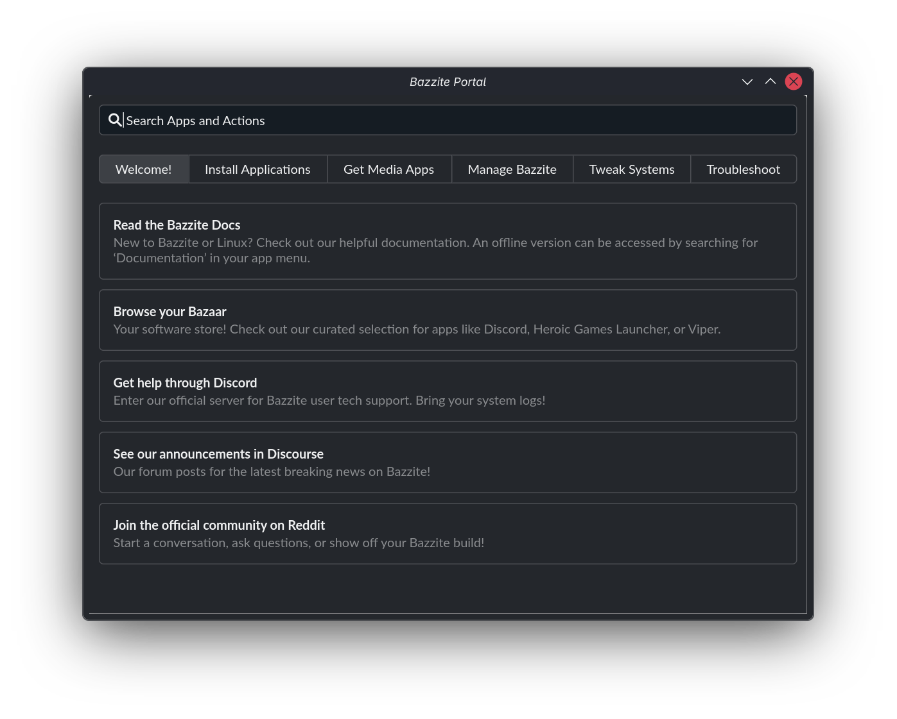
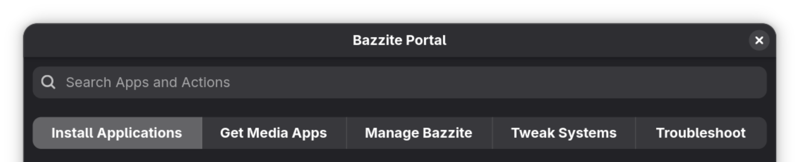
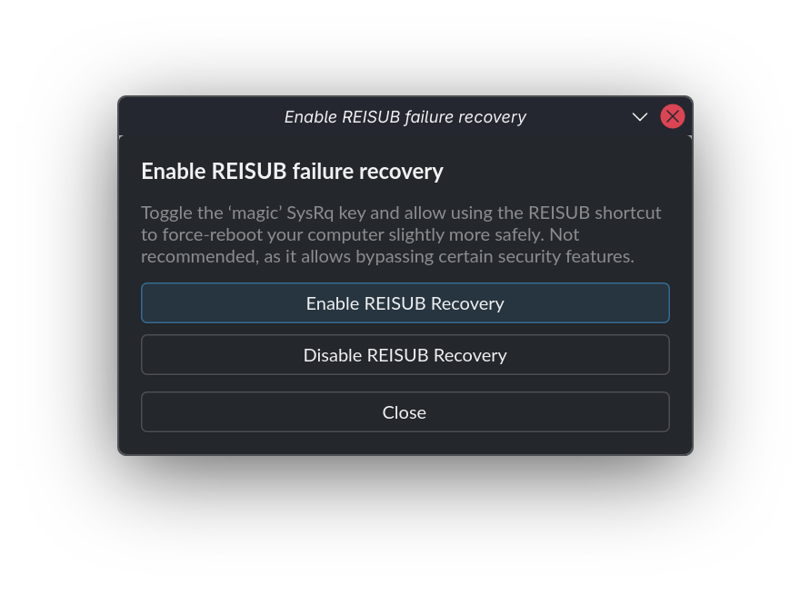

---  
title: Bazzite Portal  
---



## 概覽

Bazzite Portal 是一個基於 [`ujust`](./ujust.md) 快捷指令的設置工具，供用戶啟用特定功能、安裝常用程式、與幫助用戶進行疑難排解：

- 安裝多種工具如 [Decky](https://github.com/SteamDeckHomebrew/decky-loader)、 [OpenRGB](https://github.com/calcprogrammer1/openrgb)、和 [Waydroid](https://github.com/waydroid/waydroid)。
- 使用 [`uupd`](https://github.com/ublue-os/uupd) 透過多個套件管理工具安裝更新，包括 Bazzite、Flatpak (Bazaar)、韌體 (`fwupdmgr`) 以及 Brew。
- 從 [Universal Blue tap](https://github.com/ublue-os/homebrew-tap) 安裝 Homebrew 應用程式，並新增各種串流服務的網頁應用程式。
- 收集系統日誌、還原系統更新、將 Bazzite 重設為預設設定，或切換更新頻道以將系統更改成另一版本。

!!! tip "若欲了解 Bazzite Portal 的內部運作機制，請參閱 [Bazzite Portal 的運作方式](#how-the-bazzite-portal-works)。"
  
## 打開 Bazzite Portal

Bazzite Portal 為預安裝的系統軟件。 以下為如何打開 Bazzite Portal：

=== "KDE Plasma"

    1. 點選在畫面左下角的 **Application Launcher**
    2. 點選 **System**
    3. 點選 **Bazzite Portal**

=== "GNOME"

    1. 點選在畫面左上角的 **Activities** 按鈕
    2. 點選 **App Grid**
    3. 搜尋並點選 **Bazzite Portal**

## 設置

Bazzite Portal 的功能分為以下類別：



以下為各選項之概覽，其中包含各類別的精選項目。

---

### Welcome!

本類別提供必要的資源、社群連結及説明文件，協助新使用者開始使用 Bazzite。

| 名稱 | 詳情 | 指令 |
| :--- | :--- | :--- |
| **Read the Bazzite Docs** | 打開 Bazzite 指南網站 | `xdg-open https://docs.bazzite.gg/` |
| **Browse your Bazaar** | 打開 Bazaar 應用程式商店 | Custom script launching Bazaar |
| **Get help through Discord** | 打開 Bazzite 官方 Discord 伺服器 | `xdg-open https://discord.gg/JQq48bYzrc` |
| **See our announcements in Discourse** | 打開 Discourse 論壇上關於 Bazzite 的重要新聞頁面 | `xdg-open https://universal-blue.discourse.group/tags/c/bazzite/announcements/` |
| **Join the official community on Reddit** | 打開 Bazzite 官方 subreddit | `xdg-open https://www.reddit.com/r/Bazzite/` |

---

### Install Applications

本類別提供透過 Homebrew、Distrobox 或原生腳本進行安裝軟件的功能，包括開發工具鏈、遊戲插件及硬體管理工具等。

| 名稱 | 詳情 | 指令 |
| :--- | :--- | :--- |
| **Android Platform Tools** | 與 Android 裝置互動的指令行工具 | Brew cask script |
| **Antigravity** | 由 Google 研發，基於大語言模型的綜合開發平台 | Brew cask script |
| **asusctl & ROG Control Center** | 管理華碩硬件的工具 | `asus` |
| ... | ... | ... |
| **Visual Studio Code** | 開源的代碼編輯器／綜合開發平台 | Brew cask script |
| **VSCodium** | 社區版，完全移除非開源部分的 VSCode | Brew cask script |
| **Waydroid** | 基於容器的 Linux－Android 轉譯層 | `configure-waydroid` |

---

### Media Applications

本類別提供安裝各種遊戲及影片串流服務（例如 Spotify 和 YouTube）的網頁應用程式的功能。你可以使用此功能直接從 Steam 遊戲庫中執行網頁應用程式，如下：


---

### Manage Bazzite

本類別提供更新系統並進行進階疑難排解的功能，包括收集系統日誌、回滾系統更新、重設 Bazzite ，或切換更新頻道以將系統更改成另一版本。

- **更新 Bazzite**: 詳見[系統更新教程](Updates_Rollbacks_and_Rebasing/updating_guide.md)
- **切換更新頻道** (_stable_ 和 _testing_): 詳見[切換更新頻道](Updates_Rollbacks_and_Rebasing/rebase_guide.md)
- **回溯系統更新**: 詳見 [回溯系統更新](Updates_Rollbacks_and_Rebasing/rolling_back_system_updates.md) 與 [Bazzite Rollback Helper](Updates_Rollbacks_and_Rebasing/bazzite_rollback_helper.md)

| 名稱 | 詳情 | 指令 |
| :--- | :--- | :--- |
| **Update your system** | 更新 Bazzite、Flatpak 應用程式、與其他系統組件 | `update` |
| **Move to stable track** | 切換至 `stable`（穩定）頻道 | `brh rebase stable -y && reboot` |
| **Move to testing track** | 切換至 `testing`（測試）頻道 | `brh rebase testing -y && reboot` |
| ... | ... | ... |
| **Manage GRUB menu visibility** | 設置是否隱藏 GRUB 啟動程式 | `configure-grub` |
| **Configure GRUB timeout** | 設置 GRUB 啟動程式顯示時長 | `grub-timeout` |
| **Reboot to UEFI** | 重新啟動至主板 UEFI 介面 | `systemctl reboot --firmware-setup` |

<hr>

### Tweak Systems

本類別提供系統調整選項，包括使用者權限管理、硬盤自動掛載、系統快照管理、音訊路由設置，以及設置顯卡插幀功能等。

| 名稱 | 詳情 | 指令 |
| :--- | :--- | :--- |
| **Add "input" group** | 將用戶帳戶加到 `input` 組別之中，或能修復控制器／手柄的驅動兼容性問題 | `add-user-to-input-group` |
| **Boot to Windows from Steam** | 在 Steam 中增加重啟至 Windows 的快捷選項 | `setup-boot-windows-steam` |
| **Clean Steam icons** | 設置 Steam 桌面捷徑自動清理功能 | `steam-icons` |
| ... | ... | ... |
| **Automounting** | 管理 `BTRFS` 與 `EXT4` 硬盤位於 `/run/media/system` 的自動掛載功能 | `automounting` |
| **Toggle Input Remapper** | 啟用／停用 Input Remapper | `restore-input-remapper` |
| **SteamOS Automounting** | 管理基於 SteamOS 的自動掛載功能 | `steamos-automount` |

<hr>

### Troubleshoot

本類別提供為解決常見問題而設的診斷與修復工具。

| 名稱 | 詳情 | 指令 |
| :--- | :--- | :--- |
| **Collect system logs** | 將系統日誌和硬體資訊整合，並上傳一份可供分享的報告 | `get-logs` |
| **Rollback Bazzite** | 回溯系統更新 | `brh rollback -y && reboot` |
| **Save kernel panics** | 設置 `ramoops` 恐慌日誌記錄器，以便在重啟後仍能保留日誌。 | `toggle-save-panics` |
| ... | ... | ... |
| **Run benchmark** | 1 分鐘跑分，你也來試試吧！ | `benchmark` |
| **Enable REISUB** | 設置魔法 SysRq 快捷鍵，提供較安全的 REISUB 強制重啟功能 | `reisub` |
| **Regenerate GRUB config** | 重新生成 GRUB 設置及適配雙啟動功能 | `regenerate-grub` |

---

## Bazzite Portal 科普

本節說明 Bazzite Portal 如何透過設定檔來管理、設置與執行指令。

Bazzite Portal 的設定檔儲存於 `/usr/share/yafti/yafti.yml`，你可以在其中查看選單項目及其對應的執行指令。

下條目顯示 `reisub` 設定所使用的 `ujust` 指令：

```yaml
      - id: "reisub"
        title: "Enable REISUB failure recovery"
        description: "Toggle the ‘magic’ SysRq key and allow using the REISUB shortcut to force-reboot your computer slightly more safely. Not recommended, as it allows bypassing certain security features."
        default: false
        status_script: "ujust reisub status"
        options:
          - id: "enable"
            label: "Enable REISUB Recovery"
            script: "ujust reisub enable"
          - id: "disable"
            label: "Disable REISUB Recovery"
            script: "ujust reisub disable"
```

此設置會在 Bazzite Portal 中產生選單選項，讓你能啟用或停用 `reisub`功能：



!!! tip "想知道更多資訊？"

    若要進一步了解特定 `ujust` 指令的運作方式，請參閱 [檢視各 ujust 腳本的原始碼](./ujust.md/#view-each-ujust-scripts-source-code)。

## 項目網誌

https://github.com/ublue-os/yafti-gtk/
