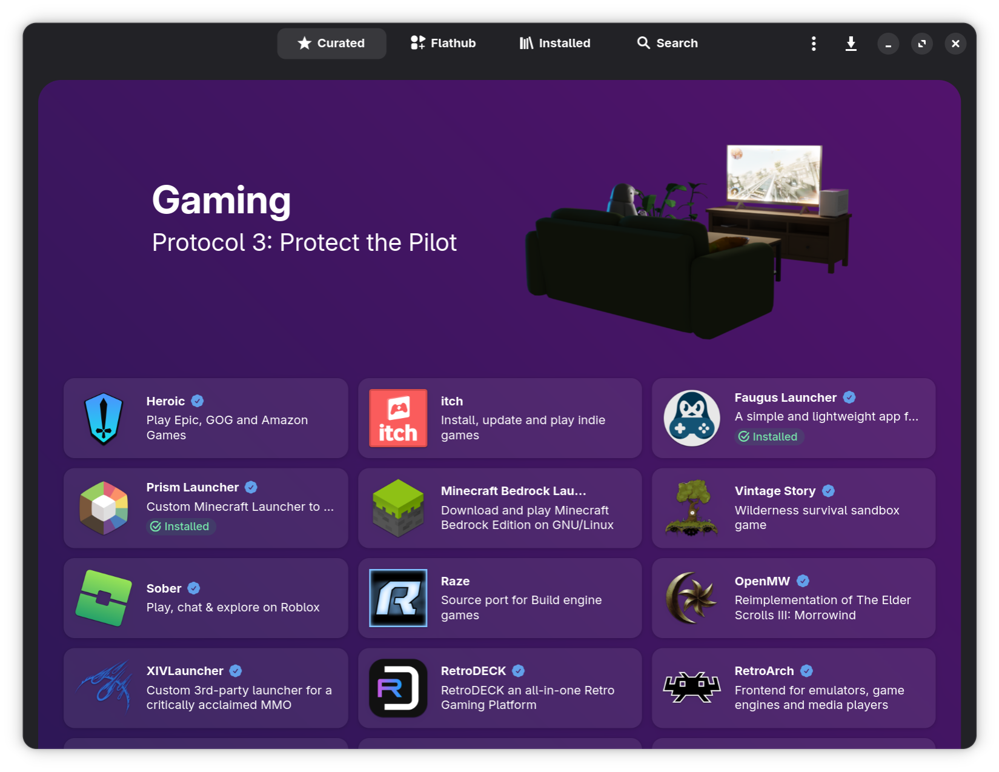

# Bazaar App Store



## Purpose

Bazaar is the **primary method of installing applications on Bazzite** _(outside of the small selection of software available in the [Bazzite Portal](./Bazzite_Portal.md) or as a [`ujust` command](./ujust.md))_  and is recommended to install most applications from Bazaar over other formats for most software when possible.  Bazaar is a frontend for [Flatpaks](https://flatpak.org/) that are from [Flathub](https://flathub.org/).

## What is Flatpak?

Flatpak is a universal containerized package format that sandboxes applications through a permissions system to restrict the access of an application to your system. Flatpaks can be graphically installed, upgraded, and uninstalled via the Bazaar app store.

### Terminal Installation

**Alternatively open a host terminal and enter**:

```
flatpak install <application>
```

## Manage Flatpaks

Manage Flatpaks with [Flatseal](https://github.com/tchx84/Flatseal) and [Warehouse](https://github.com/flattool/warehouse) which are both pre-installed. You may also use the built-in **Application Permissions → Manage Flatpak Settings** page to manage Flatpak permissions.

### Flatseal

**Flatseal** is for changing [application permissions](https://github.com/tchx84/Flatseal/blob/92e675e5ad2129f2aabf324261570eef442494f6/DOCUMENTATION.md) if necessary.

Sometimes a project's website or [Github repository](<https://github.com/flathub/com.discordapp.Discord/wiki/Rich-Precense-(discord-rpc)#flatpak-applications>) contain information on what permissions need to be changed to perform certain functionality.

### Warehouse

**Warehouse** is a utility that gives users a graphical interface to **downgrade applications**, install remote Flatpak sources outside of Flathub at your own risk, and backup application user data.

## Project Website

https://github.com/kolunmi/bazaar
