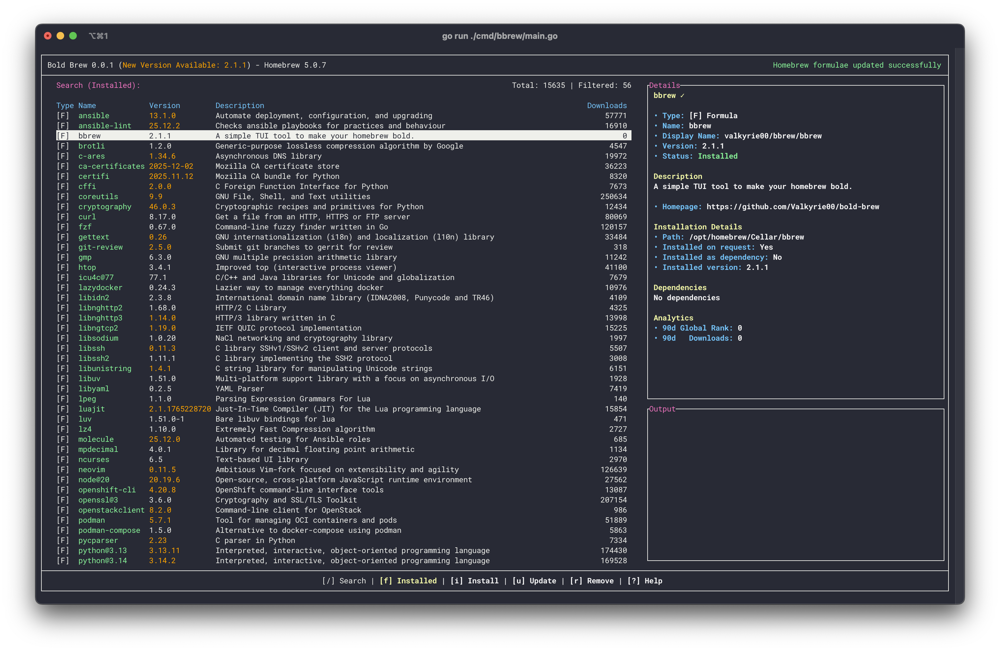

# Homebrew

## What is Homebrew?


!!! note

    Any package that requires root privileges will either need a rootful Distrobox container or has to be layered with `rpm-ostree`.

Homebrew is a package manager that installs packages into their own prefix. It is primarily used for command-line interface (CLI) and terminal user interface (TUI) applications. Homebrew can also install graphical applications using the `--cask` flag, but most are for macOS as support for casks on Linux is still developing. Use the Bold Brew application or the terminal using the command below to install packages.

Install packages in a host terminal with this **terminal command**:

```
brew install <package>
```

## Bold Brew



The [Bold Brew application](https://bold-brew.com/) offers a terminal user interface (TUI) for installing common Homebrew packages.

## Project Website

https://brew.sh/
