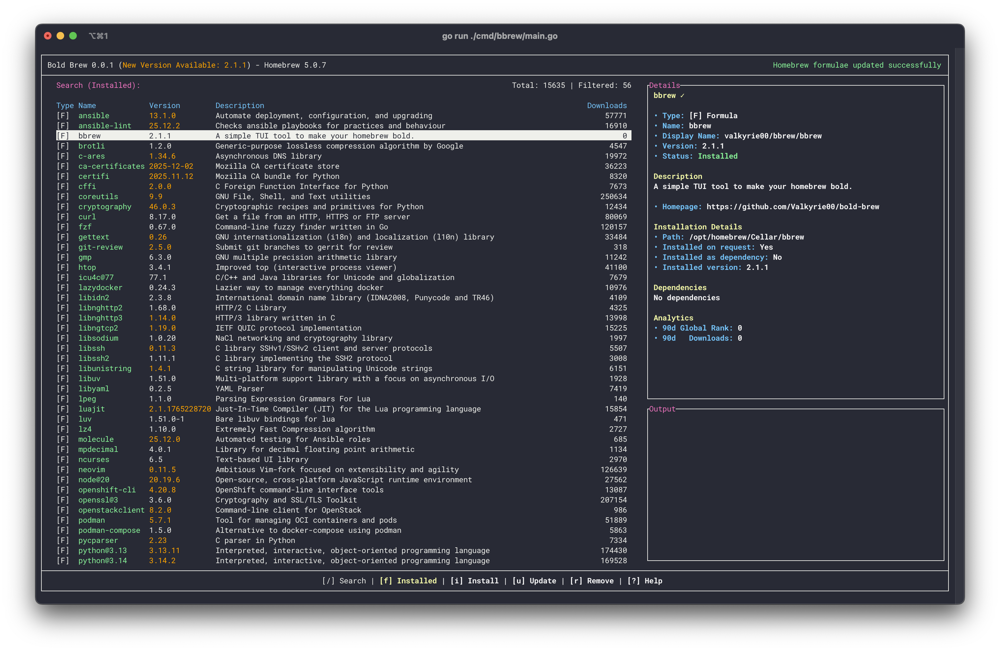

# Homebrew

## What is Homebrew?


!!! note

    Any package that requires root privileges will either need a rootful Distrobox container or has to be layered with `rpm-ostree`.

Homebrew is a package manager that installs packages into their own prefix. It is primarily used for command-line interface (CLI) and terminal user interface (TUI) applications.

Homebrew can also install graphical applications using the `--cask` flag, though most are MacOS only, as support for casks on Linux is still work-in-progress.

Install packages in a host terminal with this **terminal command** or via Bold Brew:

```bash
brew install <package>
```

!!! note

    For multiple user or atypical setups only: Root privileges (`sudo`) will be required to install Homebrew packages because it uses the `linuxbrew` user to install them.

## Bold Brew



The [Bold Brew application](https://bold-brew.com/) offers a terminal user interface (TUI) for installing common Homebrew packages.

## Fonts

Homebrew is also used for installing fonts, browse [this page](https://formulae.brew.sh/cask-font/) and install your favorite fonts. They will be copied into `~/.local/share/fonts`

- Microsoft Fonts:

If you need to install Microsoft fonts in order to ensure compatibility with some documents, most of them are in Homebrew.

Be aware that some of these fonts are copyrighted by Microsoft.
Microsoft UK confirmed you are allowed to have them, provided that you own a copy of either:

- Microsoft PowerPoint Viewer (free, retired)
- May include PowerPoint Mobile (free)
- Microsoft Office (Any version, Windows or Mac)

Calibri, Cambria, Candara, Consolas, Constantia and Corbel are included in font-microsoft-office, the others must be installed individually. You can install all of them at once by running the following command in a terminal:

```
brew tap colindean/fonts-nonfree && brew install --cask font-microsoft-office font-microsoft-aptos font-arial font-arial-black font-courier-new font-times-new-roman font-georgia
```

## Project Website

https://brew.sh/
