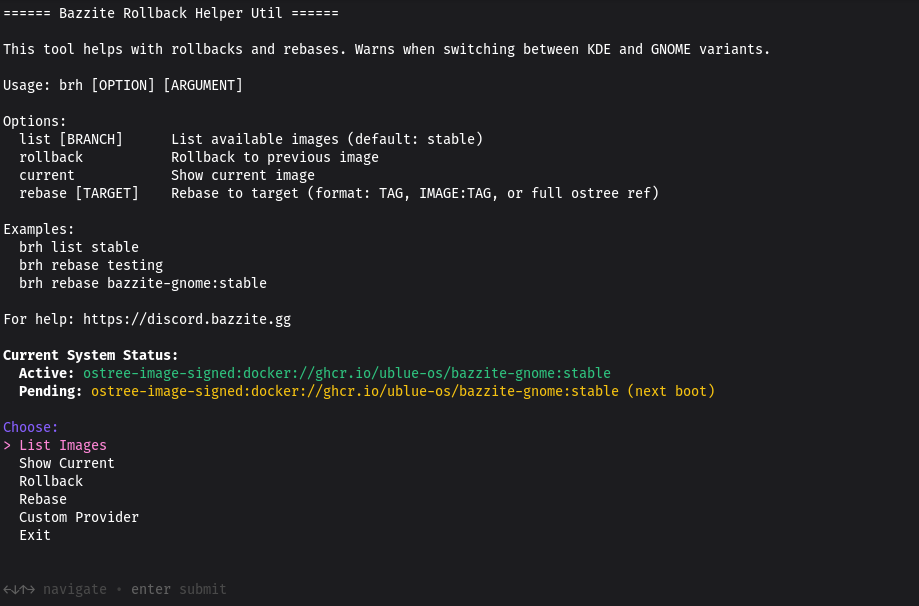

# Bazzite Rollback Helper (`brh`)



## Purpose

`bazzite-rollback-helper` is a command-line tool for rolling back system upgrades or changing the update stream.  Rollback to a Bazzite build within the last 90 days using a command-line utility that assists with **rollbacks**, **rebasing**, and **outputs information on your current Bazzite image**.

## Using `bazzite-rollback-helper`

Open a host terminal and **enter**:

```command
bazzite-rollback-helper
```

There is also an **alias** which is less typing for those on handhelds or HTPC setups without a keyboard:

```command
brh
```

## Options Available:

- `list` = List images from the last 90 days that can rebased to.
- `rollback` = Rollback to the previous deployment on the next reboot.
- `current` = Show information about your current deployment and image.
- `rebase` = Switch to another build, update branch, or a different Fedora image **at your own risk**.

### Examples

`bazzite-rollback-helper list` will list available bazzite images.

`bazzite-rollback-helper rebase <image-name:stable>` to rebase to an earlier image, update branch, or different Bazzite image (Desktop vs. Bazzite-Deck).  Find a version from the `list` command.

### Rebasing to an older Bazzite image

**Example**: `bazzite-rollback-helper rebase stable-40.20240930.0`
<sub>(This image is an example and no longer can be rolled back to as it is too old.)</sub>

Rebasing to an image will lock you to that OS image which means new features and security updates will no longer be applied until you rebase back to the Stable update channel.

Get back to normal OS updates later after the bug has been squashed that prevents you from running the Stable update channel:
`bazzite-rollback-helper rebase stable`

## Bazzite Rollback Helper Video Tutorial

https://www.youtube.com/watch?v=XvljabnzgVo
