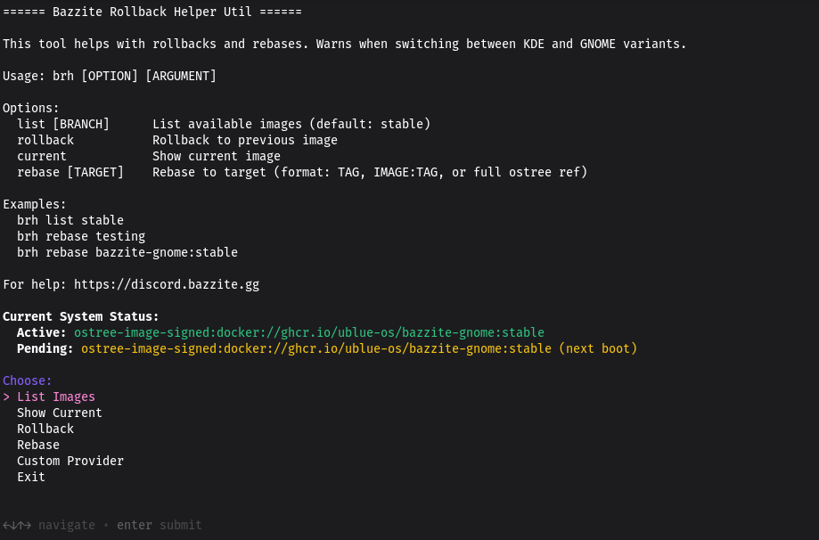

# Bazzite Rollback Helper (`brh`)



!!! note

    [Bazzite Portal](/Installing_and_Managing_Software/Bazzite_Portal.md) integrates the Bazzite Rollback Helper commands into a graphical view.

---

## Purpose

`bazzite-rollback-helper` is a command-line tool to simplify rolling back system upgrades or changing the **Image Flavor** / **Update Branch**. While the backend command, `rpm-ostree rebase` requires specifying the **full ostree ref** for a rebase, `brh rebase` will automatically fill in the rest for you.

> Detailed guides about rebasing can be found [here](/Installing_and_Managing_Software/Updates_Rollbacks_and_Rebasing/rebase_guide.md).

---

## Using `bazzite-rollback-helper`

Open a host terminal and **enter** the following command to enter interactive mode:

```bash
brh
```

You may also type the full name if you _really_ feel like typing:

```bash
bazzite-rollback-helper
```

---

## Options Available

| Option | Action |
| :-: | :- |
| `list` | List images from the last 90 days that can rebased to |
| `rollback` | Rollback to the previous deployment on the next reboot |
| `current` | Show information about your current deployment and image |
| `rebase` | Switch to another build, update branch, or a different Fedora image **at your own risk** |

!!! example

    `bazzite-rollback-helper list` will list available bazzite images.

    `bazzite-rollback-helper rebase <image-name:stable>` to rebase to an earlier image, update branch, or different Bazzite image (Desktop vs. Bazzite-Deck).  Find a version from the `list` command.

!!! tip "Use the alias `bruh moment` to rollback to the previous deployment"

---

### Rebasing to an older Bazzite image

> See [Rebase Guide](/Installing_and_Managing_Software/Updates_Rollbacks_and_Rebasing/rebase_guide/#rebasing-to-older-builds)

---

## Bazzite Rollback Helper Video Tutorial

https://www.youtube.com/watch?v=XvljabnzgVo

---
