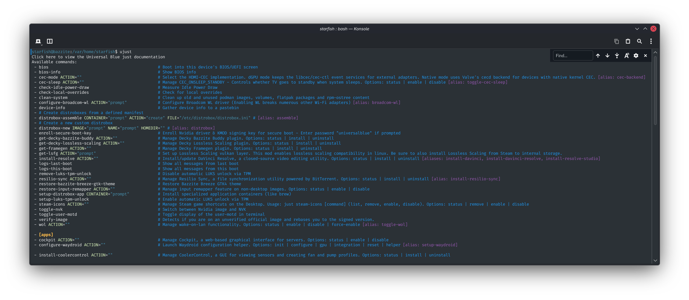

# `ujust` 快捷指令

## 用法


!!! note "溫馨提示"

    使用 [Bazzite Portal](./Bazzite_Portal.md) 介面以使用常見 `ujust` 指令。


`ujust` 指令可透過腳本自動化執行指令，常用於系統配置與維護。

其亦可安裝由專案維護者與貢獻者所提供的、隨 Bazzite 一併發行的專用軟體，這些軟體以安裝腳本的形式提供。

!!! tip "溫馨提示"

    請注意，透過 `ujust` 指令安裝的 _部分_ 軟體可能會於系統上疊加 [**套件**](../rpm-ostree.md)，這並非一個推介的包管理方法，但此實為在易用性與更新穩定性之間所做的折衷。

    雖然 Bazzite 維護者會盡力保持這些套件更新以避免功能失效，但一般建議仍是盡可能減少疊加套件的數量，並在遇到更新問題時重置系統樹。
---

### 顯示可用指令

以下指令會顯示可用腳本的清單：

```bash
ujust
```



---

### 互動式選單

以下指令將顯示 `ujust` 指令的 TUI（文字使用者介面），你可以透過方向鍵或滑鼠輸入來選擇要執行的指令：

!!! info "使用此方法時無法使用後綴參數，不過大多數指令在不帶後綴參數的情況下執行時，都會提供互動模式。"

```bash
ujust --choose
```


---

### 手動輸入指令

**找到您要使用的指令並輸入**：

```bash
ujust <指令>
```

你可以透過 **輸入** 以下內容來搜尋特定指令：

```bash
ujust | grep "<搜尋關鍵字>"
```

---

### 常用腳本命名方式

- `install-`：安裝透過其他方法難以或無法安裝的程式。

!!! warning "部分可透過 `ujust` 指令安裝的應用程式，可能會在你的系統樹上 [疊加套件](./rpm-ostree.md)。Bazzite 建議將疊加套件的數量控制在最低限度。"

- `get-`：安裝 Decky 插件，不過某些其他功能也會使用此前綴。
- `setup-`：安裝程式，並提供安裝後的解除安裝與設定選項。
- `configure-`：配置系統映像中已預設提供的工具。
  - 若需先進行安裝，則會以 `setup-` 作為前綴。
- `toggle-`：啟用或停用某項功能或設定。
  - 根據實作方式不同，選取方式可能是自動或手動。
- `fix-`：針對某個問題進行修復、修補或提供解決方案。
- `distrobox-`：Distrobox 專屬，簡化容器使用流程的腳本。
- `foo`：將此處替換為實際的命令名稱。
  - 這些是 Bazzite 認為無需使用其他前綴的腳本。
  - **範例**：`ujust update` 及 `ujust enroll-secureboot-key`

---

## 查看 `ujust` 腳本的源碼

若欲查看 `ujust` 腳本的源碼，你可以使用以下指令：

```bash
ujust --show <指令>
```

此外，你亦可於`/usr/share/ublue-os/just/`中查看所有`ujust`腳本。

!!! 注意

    此文件夾亦包含**隱藏**的腳本。

## `ujust` 腳本概覽

以下為各腳本之概覽，其中包含各類別的精選項目。

---

### 維護腳本

| 指令 | 説明 |
| --- | --- |
| `ujust update` | 一次性更新系統、Flatpak 套件及容器 |
| `ujust configure-grub` | 設定 GRUB 開機選單的顯示狀態 |
| `ujust fix-reset-steam` | 將 Steam 資料夾重置為初始狀態，同時保留遊戲、音樂、存檔等內容。若 Steam 出現問題，或在遊戲模式下遇到黑屏時，此指令非常實用 |
| `ujust fix-proton-hang` | 強制終止所有與 Wine 和 Proton 相關的程序。當遊戲未能正常關閉後無法再次啟動時，此指令相當有用 |
| `ujust bios` | 重啟至本裝置的 BIOS/UEFI 介面 |
| `ujust restart-pipewire` | 音訊有雜音？重新啟動 Pipewire 有時能解決此問題 |
| `ujust enroll-secure-boot-key` | 為安全開機功能註冊 Nvidia 驅動程式及 KMOD 簽名金鑰。若要在啟用安全開機的情況下使用 Bazzite，你將需要此功能 |
| `ujust clean-system` | 清理未使用的 Podman 映像檔、Flatpak 套件以及 rpm-ostree 系統樹 |

---

### 設定／功能性腳本

| 指令 | 説明 |
| --- | --- |
| `ujust configure-waydroid` | Waydroid 的設定輔助工具。詳情請參閱 [Waydroid 設定指南](../Installing_and_Managing_Software/Waydroid_Setup_Guide.md) |
| `ujust setup-virtualization` | 設定並配置虛擬與 VFIO 功能 |
| `ujust setup-sunshine` | 開啟或關閉 Sunshine 遊戲串流伺服器功能 |
| `ujust setup-luks-tpm-unlock` | 透過 TPM 自動解鎖 LUKS |
| `ujust setup-decky` | 安裝並配置 Decky Loader |
| `ujust setup-boot-windows-steam` | 在 Steam 中新增一個用於啟動 Windows 的腳本，用於雙啟動設置 |
| `ujust enable-tailscale` | 啟用 Tailscale |
| `ujust bazzite-cli` | Bazzite CLI 模組，基於 Bluefin 風格的 CLI 增強功能。更多資訊請參閱 [Bazzite 命令行工具](../Advanced/bazzite-cli.md) |

---

### 疑難排解腳本

| 指令 | 説明 |
| --- | --- |
| `ujust logs-last-boot` | 顯示上次開機的系統日誌 |
| `ujust logs-this-boot` | 顯示本次開機的系統日誌 |
| `ujust device-info` | 將有用的裝置資訊彙整至 Pastebin。此功能在尋求幫助或提交 Issue 的時候很有用用。 |

---

## 項目網誌

https://just.systems/man/en/
